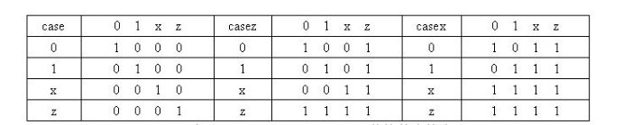

# 10. Verilog 多路分支语句

### 关键词：case，选择器

case 语句是一种多路条件分支的形式，可以解决 if 语句中有多个条件选项时使用不方便的问题。

## case 语句

case 语句格式如下：

```verilog
case(case_expr)
    condition1     :             true_statement1 ;
    condition2     :             true_statement2 ;
    ……
    default        :             default_statement ;
endcase
```

case 语句执行时，如果 condition1 为真，则执行 true_statement1 ; 如果 condition1 为假，condition2 为真，则执行 true_statement2；依次类推。如果各个 condition 都不为真，则执行 default_statement 语句。

default 语句是可选的，且在一个 case 语句中不能有多个 default 语句。

条件选项可以有多个，不仅限于 condition1、condition2 等，而且这些条件选项不要求互斥。虽然这些条件选项是并发比较的，但执行效果是谁在前且条件为真谁被执行。

ture_statement1 等执行语句可以是一条语句，也可以是多条。如果是多条执行语句，则需要用 begin 与 end 关键字进行说明。

### case 语句支持嵌套使用。

下面用 case 语句代替 if 语句实现了一个 4 路选择器的功能。仿真结果与 testbench 可参考[条件语句](https://www.runoob.com/w3cnote/verilog-condition-statement.html)一章，两者完全一致。

### 实例

```verilog
module mux4to1(
    input [1:0]     sel ,
    input [1:0]     p0 ,
    input [1:0]     p1 ,
    input [1:0]     p2 ,
    input [1:0]     p3 ,
    output [1:0]    sout);
 
    reg [1:0]     sout_t ;
    always @(*)
        case(sel)
            2'b00:   begin      
                    sout_t = p0 ;
                end
            2'b01:       sout_t = p1 ;
            2'b10:       sout_t = p2 ;
            default:     sout_t = p3 ;
        endcase
    assign sout = sout_t ;
 endmodule
```

case 语句中的条件选项表单式不必都是常量，也可以是 x 值或 z 值。

当多个条件选项下需要执行相同的语句时，多个条件选项可以用逗号分开，放在同一个语句块的候选项中。

### 例如，对 4 路选择器的 case 语句进行扩展，举例如下：

```verilog
case(sel)
    2'b00:   sout_t = p0 ;
    2'b01:   sout_t = p1 ;
    2'b10:   sout_t = p2 ;
    2'b11:     sout_t = p3 ;
    2'bx0, 2'bx1, 2'bxz, 2'bxx, 2'b0x, 2'b1x, 2'bzx :
        sout_t = 2'bxx ;
    2'bz0, 2'bz1, 2'bzz, 2'b0z, 2'b1z :
        sout_t = 2'bzz ;
    default:  $display("Unexpected input control!!!");endcase
```

## `casex`/`casez` 语句

casex、 casez 语句是 case 语句的变形，用来表示条件选项中的无关项。

casex 用 "x" 来表示无关值，casez 用问号 "?" 来表示无关值。

两者的实现的功能是完全一致的，语法与 case 语句也完全一致。

1. 在 case 语句中，敏感表达式中与各项值之间的比较是一种全等比较，每一位都相同才认为匹配。
2. 在 casez 语句中，如果分支表达式某些位的值为高阻 z，那么对这些位的比较就会忽略，不予考虑，而只关注其他位的比较结果。
3. 在 casex 语句中，则把这种处理方式进一步扩展到对 x 的处理，即如果比较双方有一方的某些位的值是 z 或 x，那么这些位的比较就不予考虑。



### 例如用 casez 语句来实现一个 4bit 控制端的 4 路选择选择器。

```verilog
module mux4to1(
    input [3:0]     sel ,
    input [1:0]     p0 ,
    input [1:0]     p1 ,
    input [1:0]     p2 ,
    input [1:0]     p3 ,
    output [1:0]    sout);
 
    reg [1:0]     sout_t ;
    always @(*)
        casez(sel)
            4'b???1:     sout_t = p0 ;
            4'b??1?:     sout_t = p1 ;
            4'b?1??:     sout_t = p2 ;
            4'b1???:     sout_t = p3 ;  
        default:         sout_t = 2'b0 ;
    endcase
    assign      sout = sout_t ;
 endmodule
```
