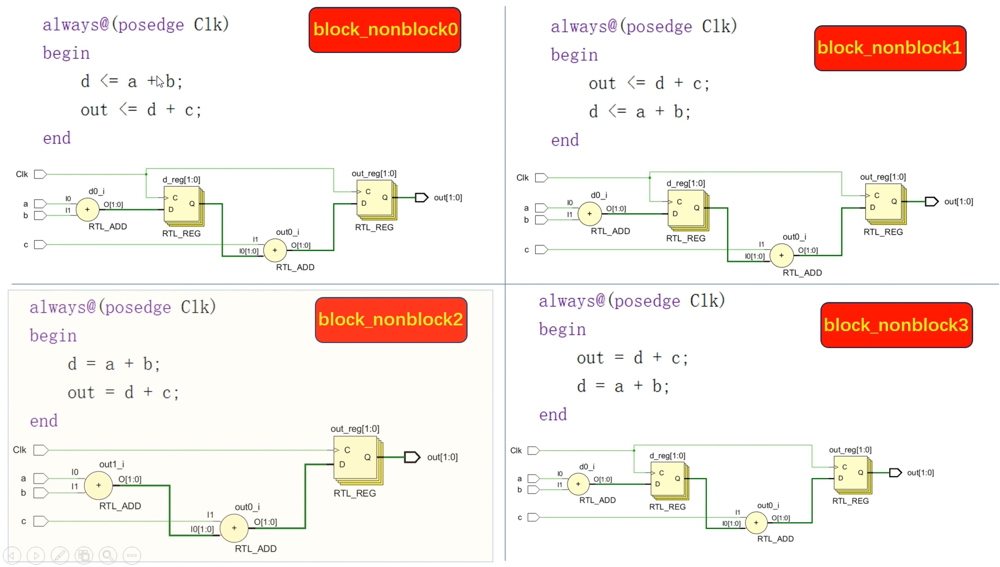
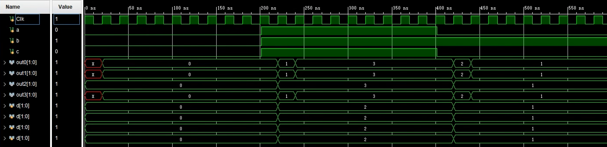

# 2023.11.16-阻塞与非阻塞赋值





组合逻辑电路使用阻塞赋值

时序逻辑电路使用非阻塞赋值

在 Verilog 中，阻塞赋值（Blocking Assignment）和非阻塞赋值（Non-Blocking Assignment）是两种不同的信号赋值方法，它们在时序逻辑的模拟和硬件描述语言（HDL）代码的编写中有着重要的区别。

### 阻塞赋值（Blocking Assignment）

- 使用符号 `=` 进行赋值。
- 阻塞赋值在执行时会“阻塞”代码的进一步执行，直到赋值完成。
- 在执行下一条语句之前，当前语句必须完成其操作。
- 在组合逻辑设计中常用，但在时序逻辑中使用可能会导致问题，因为它们可能会引起模拟时序和硬件时序的不一致。

举例：

```verilog
a = b;
c = a;
```

在这个例子中，`c = a;` 会等待 `a = b;` 完成后才执行。

### 非阻塞赋值（Non-Blocking Assignment）

- 使用符号 `<=` 进行赋值。
- 非阻塞赋值允许代码的后续部分在赋值完成之前继续执行。
- 这意味着所有非阻塞赋值都是并行发生的（或看起来如此），这更接近于硬件的实际行为。
- 在时序逻辑，特别是在描述触发器（如寄存器）的行为时非常重要和常用。

举例：

```verilog
a <= b;
c <= a;
```

在这个例子中，`c <= a;` 不会等待 `a <= b;` 的完成。`a` 和 `c` 的赋值看似同时发生。

在一个 always 块中，不同地方对同一个变量的赋值会被同时执行，最终结果是变量变成最后一次赋值的结果（前面的操作被覆盖）
