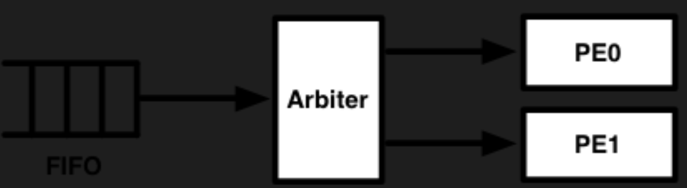

# 2024.02.24-2.2 Combinational Logic

## Common Operators

```scala
class MyModule extends Module {
  val io = IO(new Bundle {
    val in  = Input(UInt(4.W))
    val out = Output(UInt(4.W))
  })

	// Scala expression
  val two  = 1 + 1
  println(two)
	// Chisel expression
  val utwo = 1.U + 1.U
  println(utwo)
	// incorrect
	val twotwo = 1.U + 1

  io.out := io.in
}
```

```scala
class MyOperators extends Module {
  val io = IO(new Bundle {
    val in      = Input(UInt(4.W))
    val out_add = Output(UInt(4.W))
    val out_sub = Output(UInt(4.W))
    val out_mul = Output(UInt(4.W))
  })

  io.out_add := 1.U + 4.U
  io.out_sub := 2.U - 1.U
  io.out_mul := 4.U * 2.U
}

// 没有参数时可以省略小括号
test(new MyOperators) {c =>
  c.io.out_add.expect(5.U)
  c.io.out_sub.expect(1.U)
  c.io.out_mul.expect(8.U)
}
```

## Mux and Concatenation

```scala
class MyOperatorsTwo extends Module {
  val io = IO(new Bundle {
    val in      = Input(UInt(4.W))
    val out_mux = Output(UInt(4.W))
    val out_cat = Output(UInt(4.W))
  })

  val s = true.B
  io.out_mux := Mux(s, 3.U, 0.U) // should return 3.U, since s is true
  io.out_cat := Cat(2.U, 1.U)    // concatenates 2 (b10) with 1 (b1) to give 5 (101)
}

println(getVerilog(new MyOperatorsTwo))

test(new MyOperatorsTwo) { c =>
  c.io.out_mux.expect(3.U)
  c.io.out_cat.expect(5.U)
}
```

The `Mux` operates like a traditional ternary operator, with the order (select, value if true, value if false)

The `Cat` ordering is MSB then LSB (where B refers to bit or bits), and only takes two arguments.

## MAC: multiply accumulate function

```scala
class MAC extends Module {
  val io = IO(new Bundle {
    val in_a = Input(UInt(4.W))
    val in_b = Input(UInt(4.W))
    val in_c = Input(UInt(4.W))
    val out  = Output(UInt(8.W))
  })

  io.out := (io.in_a * io.in_b) + io.in_c
}

test(new MAC) { c =>
  val cycles = 100
  import scala.util.Random
  for (i <- 0 until cycles) {
    val in_a = Random.nextInt(16)
    val in_b = Random.nextInt(16)
    val in_c = Random.nextInt(16)
    c.io.in_a.poke(in_a.U)
    c.io.in_b.poke(in_b.U)
    c.io.in_c.poke(in_c.U)
    c.io.out.expect((in_a * in_b + in_c).U)
  }
}
```

## Arbiter

The following circuit arbitrates data coming from a FIFO into two parallel processing units. The FIFO and processing elements (PEs) communicate with ready-valid interfaces. Construct the arbiter to send data to whichever PE is ready to receive data, prioritizing PE0 if both are ready to receive data. Remember that the arbiter should tell the FIFO that it's ready to receive data when at least one of the PEs can receive data. Also, wait for a PE to assert that it's ready before asserting that the data are valid. You will likely need binary operators to complete this exercise.



```scala
class Arbiter extends Module {
  val io = IO(new Bundle {
    // FIFO
    val fifo_valid = Input(Bool())
    val fifo_ready = Output(Bool())
    val fifo_data  = Input(UInt(16.W))

    // PE0
    val pe0_valid  = Output(Bool())
    val pe0_ready  = Input(Bool())
    val pe0_data   = Output(UInt(16.W))

    // PE1
    val pe1_valid  = Output(Bool())
    val pe1_ready  = Input(Bool())
    val pe1_data   = Output(UInt(16.W))
  })

  io.fifo_ready := io.pe0_ready || io.pe1_ready
  io.pe0_valid  := io.fifo_valid && io.pe0_ready
  io.pe1_valid  := io.fifo_valid && !io.pe0_ready && io.pe1_ready
  io.pe0_data   := io.fifo_data
  io.pe1_data   := io.fifo_data
}

test(new Arbiter) { c =>
  import scala.util.Random
  val data = Random.nextInt(65536)
  c.io.fifo_data.poke(data.U)

  for (i <- 0 until 8) {
    c.io.fifo_valid.poke((((i >> 0) % 2) != 0).B)
    c.io.pe0_ready.poke((((i >> 1) % 2) != 0).B)
    c.io.pe1_ready.poke((((i >> 2) % 2) != 0).B)

    c.io.fifo_ready.expect((i > 1).B)
    c.io.pe0_valid.expect((i == 3 || i == 7).B)
    c.io.pe1_valid.expect((i == 5).B)

    if (i == 3 || i ==7) {
      c.io.pe0_data.expect((data).U)
    } else if (i == 5) {
      c.io.pe1_data.expect((data).U)
    }
  }
}
println("SUCCESS!!")
```

数据线（如`io.pe0_data` 和 `io.pe1_data`）通常会持续地带有它们可能需要使用的数据信号（本例中为`io.fifo_data`）。但是，这些数据是否被“接收”或“采用”通常由`valid`信号来控制。

测试代码设计用来验证`Arbiter`模块的行为。测试通过随机生成一个数据，然后使用不同的组合的`fifo_valid`，`pe0_ready`和`pe1_ready`信号来模拟不同的工作情况。

- `c.io.fifo_data.poke(data.U)`模拟从 FIFO 发送的数据。
- 循环`for (i <- 0 until 8)`遍历 8 种不同的信号组合状态。
- `c.io.fifo_valid.poke`，`c.io.pe0_ready.poke`和`c.io.pe1_ready.poke`根据`i`的不同值模拟不同的信号状态，使用位操作来确定每个信号是否应该被激活。
- `c.io.fifo_ready.expect`，`c.io.pe0_valid.expect`和`c.io.pe1_valid.expect`是对仲裁器预期行为的断言检查。
- 如果`i`的值表示 PE0 或 PE1 应该接收数据（如`i == 3 || i == 7`是 PE0，`i == 5`是 PE1），则使用`expect`断言来检查`io.pe0_data`或`io.pe1_data`与 FIFO 的数据相同。

## Parameterized Adder

```scala
class ParameterizedAdder(saturate: Boolean) extends Module {
  val io = IO(new Bundle {
    val in_a = Input(UInt(4.W))
    val in_b = Input(UInt(4.W))
    val out  = Output(UInt(4.W))
  })
  val sum = io.in_a +& io.in_b
  if(saturate){
    io.out := Mux(sum>15.U,15.U,sum)
  }else{
    io.out := sum
  }
}

for (saturate <- Seq(true, false)) {
  test(new ParameterizedAdder(saturate)) { c =>
    // 100 random tests
    val cycles = 100
    import scala.util.Random
    import scala.math.min
    for (i <- 0 until cycles) {
      val in_a = Random.nextInt(16)
      val in_b = Random.nextInt(16)
      c.io.in_a.poke(in_a.U)
      c.io.in_b.poke(in_b.U)
      if (saturate) {
        c.io.out.expect(min(in_a + in_b, 15).U)
      } else {
        c.io.out.expect(((in_a + in_b) % 16).U)
      }
    }

    // ensure we test saturation vs. truncation
    c.io.in_a.poke(15.U)
    c.io.in_b.poke(15.U)
    if (saturate) {
      c.io.out.expect(15.U)
    } else {
      c.io.out.expect(14.U)
    }
  }
}
println("SUCCESS!!")
```

在 Chisel 中，`+&`是一个用于加法的运算符，它会考虑输入的进位，得到一个比最大输入位宽更宽的结果。如果输入是 4 位`UInt`，标准加法结果`io.in_a + io.in_b`会是 4 位，可能会截断超出的位。而`+&`加法会产生一个 5 位的结果，这可以用于在必要时实现饱和加法逻辑。连接一个 4 位的`UInt`线到一个 5 位的`UInt`线（一个 4.W 的量等于 5.W 的量），默认会截断最高位（MSB）。这样，你可以用这个方法来轻松实现非饱和加法器，只保留 5 位和的低 4 位。
