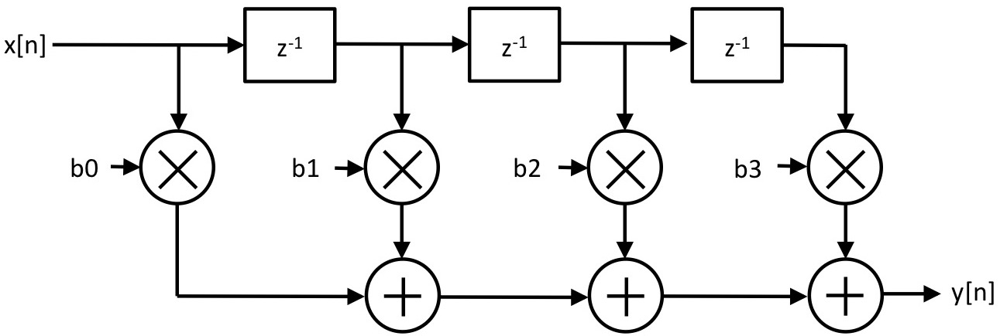

# 2024.02.28-2.5 FIR Filter



$$y[n] = b_0 x[n] + b_1 x[n-1] + b_2 x[n-2] + ...$$

```scala
class My4ElementFir(b0: Int, b1: Int, b2: Int, b3: Int) extends Module {
  val io = IO(new Bundle {
    val in = Input(UInt(8.W))
    val out = Output(UInt(8.W))
  })

  val reg_1 = RegInit(0.U(8.W))
  val reg_2 = RegInit(0.U(8.W))
  val reg_3 = RegInit(0.U(8.W))

  reg_1 := io.in
  reg_2 := reg_1
  reg_3 := reg_2

	// 或者使用RegNext来一并定义初始化及赋值
	val reg_1 = RegNext(io.in, 0.U)
	val reg_2 = RegNext(reg_1, 0.U)
	val reg_3 = RegNext(reg_2, 0.U)

  io.out := b0.U(8.W) * io.in + b1.U(8.W) * reg_1 + b2.U(8.W) * reg_2 + b3.U(8.W) * reg_3
}
```

## FIR Filter Generator

一个有限脉冲响应（FIR）滤波器生成器。生成器的`length`参数决定了滤波器的抽头数目，即滤波器的长度。这个生成器有三个输入：`in`（滤波器的输入信号）、`valid`（一个布尔值，表示输入是否有效）和`consts`（一个向量，包含所有抽头的系数）。还有一个输出`out`，即滤波器的输出。

- `taps`是一个序列，包含输入和一系列寄存器，用于实现滤波器的延迟线。
- 当`valid`信号为真时，序列中的每个元素（除了第一个）被更新为前一个元素的值。
- 输出`out`是抽头值和对应系数乘积之和。

这个结构允许滤波器动态处理不同长度的输入，通过改变`consts`向量的内容来改变滤波器的特性。

```scala
class MyManyDynamicElementVecFir(length: Int) extends Module {
  val io = IO(new Bundle {
    val in = Input(UInt(8.W))
    val valid = Input(Bool())
    val out = Output(UInt(8.W))
    val consts = Input(Vec(length, UInt(8.W)))
  })

  // Such concision! You'll learn what all this means later.
  val taps = Seq(io.in) ++ Seq.fill(io.consts.length - 1)(RegInit(0.U(8.W)))
  taps.zip(taps.tail).foreach { case (a, b) => when (io.valid) { b := a } }

  io.out := taps.zip(io.consts).map { case (a, b) => a * b }.reduce(_ + _)
}

visualize(() => new MyManyDynamicElementVecFir(4))
```

1. `val io = IO(new Bundle {...})`定义了模块的接口，包括 8 位宽的输入`in`，一个有效信号`valid`，8 位宽输出`out`，和长度为`length`的系数向量`consts`。
2. `val taps = Seq(io.in) ++ Seq.fill(io.consts.length - 1)(RegInit(0.U(8.W)))`这行代码在 FIR 滤波器实现中创建了一个名为`taps`的序列，用于存储当前和之前的输入值，从而实现数据的时间序列延迟。首先，它将输入信号`io.in`作为序列的第一个元素。随后，使用`++`操作符将`io.in`与一个新的序列连接起来，后者通过`Seq.fill(io.consts.length - 1)(RegInit(0.U(8.W)))`创建，其中包含`length - 1`个初始化为 0 的 8 位寄存器。这样，`taps`序列就包含了一个输入信号和`length - 1`个延迟寄存器，总共`length`个元素，每个元素对应滤波器的一个抽头。在 Chisel 中，虽然`io.in`不是寄存器，但`taps`序列可以包含不同类型的元素，因为在 Chisel 里，所有这些都被视为`Data`类型的子类，可以被综合为硬件。在这个上下文中，`io.in`是直接的输入信号，而后续元素是寄存器类型，但它们共同构成了一个序列，用于表示滤波器的不同时间点上的信号值。这种混合类型的序列是可行的，并可以在 Chisel 生成的硬件中正确表达相应的逻辑。
3. `taps.zip(taps.tail).foreach { case (a, b) => when (io.valid) { b := a } }`在输入`valid`为真时，将`taps`序列中每个元素的值传递到下一个元素，实现数据在寄存器间的移动。

   `zip`是一个方法，它将两个集合中对应位置的元素组成一对，生成一个新的集合。在这里，`taps.zip(taps.tail)`的作用是将`taps`列表中的每个元素与其后面的元素配对。`tail`是一个方法，返回除第一个元素外的列表所有元素。例如，如果`taps`是`[in, reg1, reg2, reg3]`，那么`taps.tail`就是`[reg1, reg2, reg3]`。`taps.zip(taps.tail)`的结果将是`[(in, reg1), (reg1, reg2), (reg2, reg3)]`。这样，`foreach`就可以遍历这些配对，根据`valid`信号更新寄存器的值，实现数据的逐级传递。

   `case (a, b) =>`是模式匹配的语法，用于解构元组，将`zip`操作生成的元素对分别赋值给`a`（当前元素）和`b`（下一个元素）。

4. `io.out := taps.zip(io.consts).map { case (a, b) => a * b }.reduce(_ + _)`计算输出`out`，即将每个延迟元素与其对应的系数相乘，并将所有乘积求和得到最终结果。

   在这段代码中，`map`和`reduce`是 Scala 中的集合操作方法：

   - `map`：对集合中的每个元素应用一个函数。这里`map { case (a, b) => a * b }`对每对`(a, b)`应用乘法操作，`a`来自`taps`，`b`来自`io.consts`，分别代表寄存器中的数据和滤波器的系数。
   - `reduce`：对集合中的元素应用一个二元操作，逐步将集合减少为单一结果。这里的`reduce(_ + _)`将所有乘法结果相加，得到最终的滤波输出。

   不使用`foreach`是因为`foreach`仅用于执行操作而不返回结果，而这里的目的是计算经过滤波器后的输出值，需要通过`map`和`reduce`聚合计算结果。
