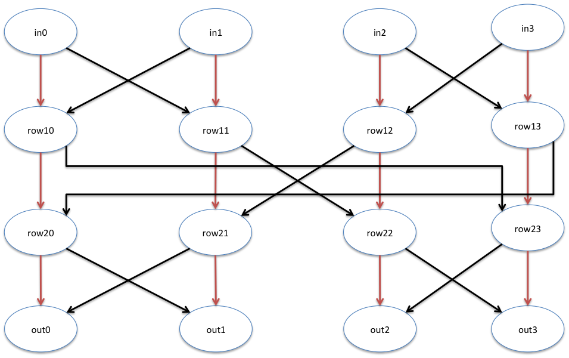

# 2024.03.01-3.1 Generators: Parameters

## Parameter Passing

### Example: Parameterized Scala Object

```scala
class ParameterizedScalaObject(param1: Int, param2: String) {
  println(s"I have parameters: param1 = $param1 and param2 = $param2")
}
val obj1 = new ParameterizedScalaObject(4,     "Hello")
val obj2 = new ParameterizedScalaObject(4 + 2, "World")
```

### Example: Parameterized Chisel Object

```scala
class ParameterizedWidthAdder(in0Width: Int, in1Width: Int, sumWidth: Int) extends Module {
  require(in0Width >= 0)
  require(in1Width >= 0)
  require(sumWidth >= 0)
  val io = IO(new Bundle {
    val in0 = Input(UInt(in0Width.W))
    val in1 = Input(UInt(in1Width.W))
    val sum = Output(UInt(sumWidth.W))
  })
  // a +& b includes the carry, a + b does not
  io.sum := io.in0 +& io.in1
}

println(getVerilog(new ParameterizedWidthAdder(1, 4, 6)))
```

The above code block has some `require(...)` statements. These are pre-elaboration assertions, which are useful when your generator only works with certain parameterizations or when some parameterizations are mutually exclusive or nonsensical. The above code block checks that widths are non-negative.

### Example: Parameterized 4-input Sort



```scala
/ Sort4 sorts its 4 inputs to its 4 outputs */
class Sort4(ascending: Boolean) extends Module {
  val io = IO(new Bundle {
    val in0 = Input(UInt(16.W))
    val in1 = Input(UInt(16.W))
    val in2 = Input(UInt(16.W))
    val in3 = Input(UInt(16.W))
    val out0 = Output(UInt(16.W))
    val out1 = Output(UInt(16.W))
    val out2 = Output(UInt(16.W))
    val out3 = Output(UInt(16.W))
  })

  // this comparison funtion decides < or > based on the module's parameterization
  def comp(l: UInt, r: UInt): Bool = {
      if (ascending) {
        l < r
      } else {
        l > r
    }
  }

  val row10 = Wire(UInt(16.W))
  val row11 = Wire(UInt(16.W))
  val row12 = Wire(UInt(16.W))
  val row13 = Wire(UInt(16.W))

  when(comp(io.in0, io.in1)) {
    row10 := io.in0            // preserve first two elements
    row11 := io.in1
  }.otherwise {
    row10 := io.in1            // swap first two elements
    row11 := io.in0
  }

  when(comp(io.in2, io.in3)) {
    row12 := io.in2            // preserve last two elements
    row13 := io.in3
  }.otherwise {
    row12 := io.in3            // swap last two elements
    row13 := io.in2
  }

  val row21 = Wire(UInt(16.W))
  val row22 = Wire(UInt(16.W))

  when(comp(row11, row12)) {
    row21 := row11            // preserve middle 2 elements
    row22 := row12
  }.otherwise {
    row21 := row12            // swap middle two elements
    row22 := row11
  }

  val row20 = Wire(UInt(16.W))
  val row23 = Wire(UInt(16.W))
  when(comp(row10, row13)) {
    row20 := row10            // preserve the first and the forth elements
    row23 := row13
  }.otherwise {
    row20 := row13            // swap the first and the forth elements
    row23 := row10
  }

  when(comp(row20, row21)) {
    io.out0 := row20            // preserve first two elements
    io.out1 := row21
  }.otherwise {
    io.out0 := row21            // swap first two elements
    io.out1 := row20
  }

  when(comp(row22, row23)) {
    io.out2 := row22            // preserve first two elements
    io.out3 := row23
  }.otherwise {
    io.out2 := row23            // swap first two elements
    io.out3 := row22
  }
}
```

## Option and Defualt Arguments

```scala
val map = Map("a" -> 1)
val a = map.get("a")
println(a)
val b = map.get("b")
println(b)
```

在 Scala 中，`Map.get(key)`方法返回一个`Option`类型：如果键存在，则返回`Some(value)`；如果键不存在，则返回`None`。在您的例子中，`map.get("a")`返回`Some(1)`，因为"a"是映射中的一个键，值为 1。然而，`map.get("b")`返回`None`，因为"b"不是映射中的键。`Some`和`None`用于 Scala 中以安全且表达性的方式处理值的存在或缺失，避免空指针异常。

```scala
val some = Some(1)
val none = None
println(some.get)          // Returns 1
// println(none.get)       // Errors!
println(some.getOrElse(2)) // Returns 1
println(none.getOrElse(2)) // Returns 2
```

`getOrElse`是一个常用于`Option`类型的方法，它允许你为`Option`可能不包含值（即为`None`）的情况提供一个默认值。`getOrElse`接受一个参数，这个参数是当`Option`为`None`时将返回的值。如果`Option`是`Some`，则`getOrElse`会返回包裹在`Some`中的值。

### Options for Parameters with Defaults

```scala
class DelayBy1(resetValue: Option[UInt] = None) extends Module {
    val io = IO(new Bundle {
        val in  = Input( UInt(16.W))
        val out = Output(UInt(16.W))
    })
    val reg = if (resetValue.isDefined) { // resetValue = Some(number)
        RegInit(resetValue.get)
    } else { //resetValue = None
        Reg(UInt())
    }
    reg := io.in
    io.out := reg
}

println(getVerilog(new DelayBy1))
println(getVerilog(new DelayBy1(Some(3.U))))
```

将 `resetValue` 默认初始化为 `Option[UInt] = None`，`Reg(UInt())` 可以从上下文中自动推断，不过最好还是指定位宽

```scala
// 还可以用match来实现ifelse
class DelayBy1(resetValue: Option[UInt] = None) extends Module {
  val io = IO(new Bundle {
    val in  = Input( UInt(16.W))
    val out = Output(UInt(16.W))
  })
  val reg = resetValue match {
    case Some(r) => RegInit(r)
    case None    => Reg(UInt())
  }
  reg := io.in
  io.out := reg
}
```

## Match/Case Statements

Scala 中的匹配概念在 Chisel 中被广泛使用，是每个 Chisel 程序员必须理解的基础知识。Scala 提供的 match 操作符支持以下功能：

- 用于检测多种情况的简单测试，类似于 C 语言中的 switch 语句。
- 对值的复杂组合进行测试。
- 根据变量的类型采取行动，当变量类型未知或未完全指定时，例如：
  - 从异构列表中取变量，如`val mixedList = List(1, "string", false)`。
  - 变量已知属于一个超类，但不确定是哪个具体的子类。
- 使用正则表达式提取字符串的子串。

### Example: Value Matching

```scala
// y is an integer variable defined somewhere else in the code
val y = 7
/// ...
val x = y match {
  case 0 => "zero" // One common syntax, preferred if fits in one line
  case 1 =>        // Another common syntax, preferred if does not fit in one line.
      "one"        // Note the code block continues until the next case
  case 2 => {      // Another syntax, but curly braces are not required
      "two"
  }
  case _ => "many" // _ is a wildcard that matches all values
}
println("y is " + x) // out: y is many
```

y 为 7，不匹配，因此采用默认值

- 每个跟在`=>`操作符后面的代码块都会继续执行，直到它到达`match`的结束大括号或下一个`case`语句。
- `match`会按照`case`语句的顺序进行搜索，一旦匹配到一个`case`语句，就不会再对其他`case`语句进行检查。
- 使用下划线`_`作为通配符，来处理任何未找到匹配的值。

### Example: Multiple Value Matching

```scala
def animalType(biggerThanBreadBox: Boolean, meanAsCanBe: Boolean): String = {
  (biggerThanBreadBox, meanAsCanBe) match {
    case (true, true) => "wolverine"
    case (true, false) => "elephant"
    case (false, true) => "shrew"
    case (false, false) => "puppy"
  }
}
println(animalType(true, true)) // wolverine
```

### Example: Type Matching

```scala
val sequence = Seq("a", 1, 0.0)
sequence.foreach { x =>
  x match {
    case s: String => println(s"$x is a String")
    case s: Int    => println(s"$x is an Int")
    case s: Double => println(s"$x is a Double")
    case _ => println(s"$x is an unknown type!")
  }
}
```

`Seq`是 Scala 集合中的一个接口，它代表序列，而`List`是`Seq`的一个具体实现。在这个例子中，可以直接用`List("a", 1, 0.0)`来代替`Seq("a", 1, 0.0)`，而不会影响`foreach`和`match`语句的行为。

### Example: Multiple Type Matching

If you want to match on whether a value has one of many types, use the following syntax. Note that you must use an `_` when matching.

```scala
val sequence = Seq("a", 1, 0.0)
sequence.foreach { x =>
  x match {
    case _: Int | _: Double => println(s"$x is a number!")
    case _ => println(s"$x is an unknown type!")
  }
}
```

### Example: Type Matching and Erasure

类型匹配在 Scala 中有一些限制。由于 Scala 运行在 JVM 上，而 JVM 不保持多态类型信息，因此你不能在运行时基于它们进行匹配（因为这些类型信息已被擦除）。注意下面的例子始终匹配第一个 case 语句，因为`[String]`、`[Int]`、`[Double]`这些多态类型在运行时被擦除了，case 语句实际上只是在匹配`Seq`。

```scala
val sequence = Seq(Seq("a"), Seq(1), Seq(0.0))
sequence.foreach { x =>
  x match {
    case s: Seq[String] => println(s"$x is a String")
    case s: Seq[Int]    => println(s"$x is an Int")
    case s: Seq[Double] => println(s"$x is a Double")
  }
}
```

在 Scala 中，类型擦除指的是 JVM 在运行时不保留泛型的具体类型信息。因此，当你对`Seq[String]`、`Seq[Int]`或`Seq[Double]`进行模式匹配时，JVM 实际上无法区分这些`Seq`的元素类型，因为泛型信息`[String]`、`[Int]`、`[Double]`已经被擦除，只留下了基础的`Seq`类型。所以，这些 case 语句在运行时都被视为对`Seq`类型的匹配，而无法区分具体是哪种`Seq`。因此，匹配总是成功于第一个 case，无论其实际参数是什么类型的`Seq`。这就是为什么在运行时你看到的行为似乎是它总是匹配`Seq`的原因。

## IOs with Optional Fields

有时我们希望 IO 端口能够根据需要选择性地包含或排除。例如，在调试时可能需要查看一些内部状态，但在生成器用于系统时希望将其隐藏。或者，你的生成器可能有一些输入在某些情况下不需要连接，因为存在合理的默认值。

### Example: Optional IO with Option

示例中展示了一个可选地接收进位信号的一位加法器。如果包含进位，`io.carryIn`将是`Some[UInt]`类型并包含在 IO 束中；如果不包含进位，`io.carryIn`将是`None`类型并从 IO 束中排除。

```scala
class HalfFullAdder(val hasCarry: Boolean) extends Module {
  val io = IO(new Bundle {
    val a = Input(UInt(1.W))
    val b = Input(UInt(1.W))
    val carryIn = if (hasCarry) Some(Input(UInt(1.W))) else None
    val s = Output(UInt(1.W))
    val carryOut = Output(UInt(1.W))
  })
  val sum = io.a +& io.b +& io.carryIn.getOrElse(0.U)
  io.s := sum(0)
  io.carryOut := sum(1)
}
```

### Example: Optional IO with Zero-Width Wires

```scala
class HalfFullAdder(val hasCarry: Boolean) extends Module {
  val io = IO(new Bundle {
    val a = Input(UInt(1.W))
    val b = Input(UInt(1.W))
    val carryIn = Input(if (hasCarry) UInt(1.W) else UInt(0.W))
    val s = Output(UInt(1.W))
    val carryOut = Output(UInt(1.W))
  })
  val sum = io.a +& io.b +& io.carryIn
  io.s := sum(0)
  io.carryOut := sum(1)
}
```

也可以用一个 0 宽度的 wire 来代替 None。An IO with width zero is pruned from the emitted Verilog, and anything that tries to use the value of a zero-width wire gets a constant zero.

## Implicits

为了减少大量重复的模板代码，Scala 引入了*隐式（implicits）*的概念，允许编译器为你自动进行一些语法简化。由于很多操作是在背后进行，隐式使用可能显得很神奇。

### Implicit Arguments

隐式参数的一个常见用途是当你的代码在深层的函数调用中需要访问某个顶层变量时，可以使用隐式参数自动传递这个变量，而不是手动在每个函数调用中传递它。

### Example: Implicit Cats

```scala
object CatDog {
  implicit val numberOfCats: Int = 3
  //implicit val numberOfDogs: Int = 5

  def tooManyCats(nDogs: Int)(implicit nCats: Int): Boolean = nCats > nDogs

  val imp = tooManyCats(2)    // Argument passed implicitly!
  val exp = tooManyCats(2)(1) // Argument passed explicitly!
}
CatDog.imp
CatDog.exp
```

首先，我们定义了一个隐式值`numberOfCats`。在给定的作用域中，同一类型的隐式值只能有一个。然后，我们定义了一个函数，它接受两个参数列表；第一个是任何显式参数，第二个是任何隐式参数。当我们调用`tooManyCats`时，我们可以省略第二个隐式参数列表（让编译器为我们找到它），或者显式提供一个参数（这个参数可以与隐式值不同）。

隐式参数可能失败的情况包括：

- 在一个作用域中定义了给定类型的两个或多个隐式值
- 如果编译器找不到调用函数所需的隐式值

`object`定义了一个单例对象，它是一个类的单一实例。与`class`不同，当你定义一个`object`时，Scala 会自动为你创建这个类的一个实例。你不需要使用`new`关键字来创建它的实例。在这个例子中，`CatDog`是一个单例对象，可以直接访问其成员，无需创建实例。这在定义工具方法或当你需要一个全局唯一的实体时非常有用，比如这里的`numberOfCats`隐式值和`tooManyCats`方法。

### Example: Implicit Logging

```scala
sealed trait Verbosity
implicit case object Silent extends Verbosity
case object Verbose extends Verbosity

class ParameterizedWidthAdder(in0Width: Int, in1Width: Int, sumWidth: Int)(implicit verbosity: Verbosity)
extends Module {
  def log(msg: => String): Unit = verbosity match {
    case Silent =>
    case Verbose => println(msg)
  }
  require(in0Width >= 0)
  log(s"in0Width of $in0Width OK")
  require(in1Width >= 0)
  log(s"in1Width of $in1Width OK")
  require(sumWidth >= 0)
  log(s"sumWidth of $sumWidth OK")
  val io = IO(new Bundle {
    val in0 = Input(UInt(in0Width.W))
    val in1 = Input(UInt(in1Width.W))
    val sum = Output(UInt(sumWidth.W))
  })
  log("Made IO")
	// 对于结果位宽自然容纳进位的情况，直接使用+也是可行的。
  io.sum := io.in0 + io.in1
  log("Assigned output")
}

println(getVerilog(new ParameterizedWidthAdder(1, 4, 5)))
println(getVerilog(new ParameterizedWidthAdder(1, 4, 5)(Verbose)))
```

1. 定义了一个名为`Verbosity`的密封特质（`sealed trait`）和两个实现这个特质的对象。`sealed trait Verbosity`表示`Verbosity`是一个可以被继承的类型，但所有继承它的类必须定义在同一个文件中，这有助于实现模式匹配的完整性检查。`implicit case object Silent extends Verbosity`定义了一个隐式的单例对象`Silent`，它是`Verbosity`的一个实现，可以在需要`Verbosity`类型的隐式参数时自动使用。`case object Verbose extends Verbosity`定义了另一个名为`Verbose`的单例对象，也是`Verbosity`的实现。`case object`通常用于代表不可变、无状态的值或单例定义.
2. `msg: => String`这样的参数定义使用了名为“call-by-name”的参数传递机制。这种机制意味着，只有在函数内部实际使用到`msg`时，传入的字符串表达式才会被计算。这对于条件日志记录来说非常有用，因为它允许延迟计算日志消息直到确实需要打印消息时。例如，如果`verbosity`是`Silent`，则`msg`根本不会被计算，这样就避免了不必要的性能开销。

### Implicit Conversions

隐式函数（也称为隐式转换）用于减少模板代码。更具体地说，它们用于自动将一个 Scala 对象转换为另一个对象。

### Example: Implicit Conversion

在下面的例子中，我们有两个类，`Animal`和`Human`。`Animal`有一个`species`字段，但`Human`没有。然而，通过实现一个隐式转换，我们可以在`Human`上调用`species`方法。这意味着即使`Human`类原本不包含`species`字段，通过隐式转换，我们也可以像访问自己的属性一样访问`species`，就好像这个属性是`Human`类的一部分一样。

```scala
class Animal(val name: String, val species: String)
class Human(val name: String)
implicit def human2animal(h: Human): Animal = new Animal(h.name, "Homo sapiens")
val me = new Human("Adam")
println(me.species)
```
