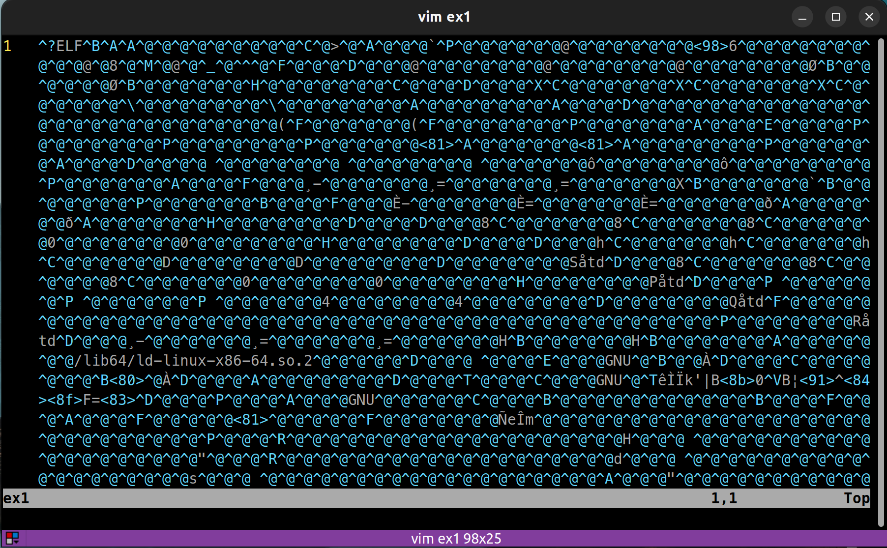
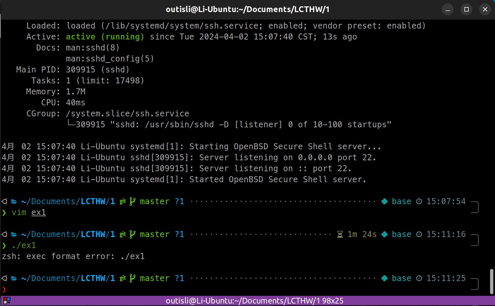
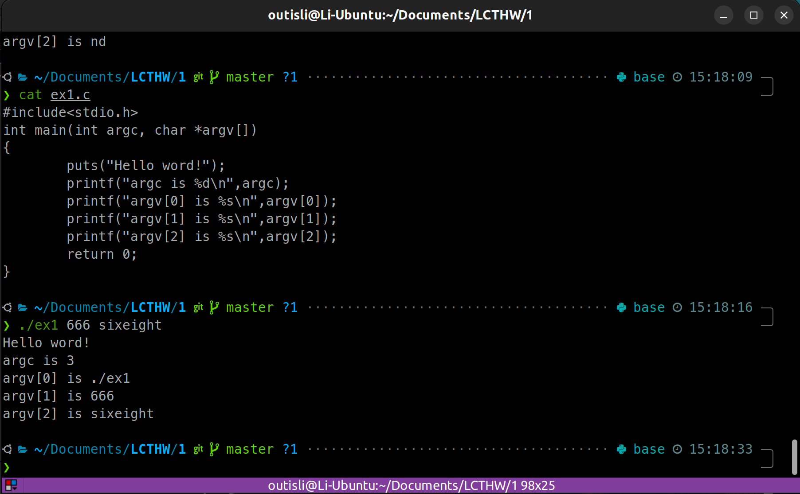
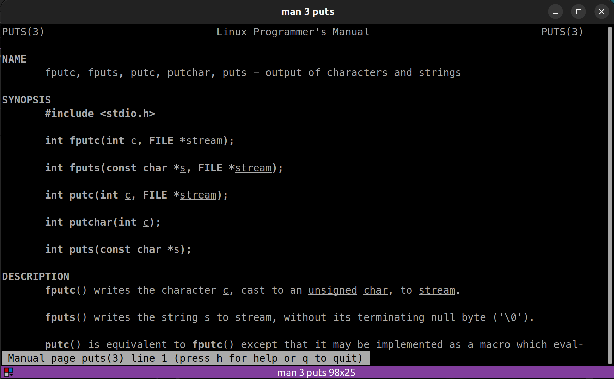

# 2024.04.02-练习 1：启用编译器

## 1. make

```cpp
int main(int argc, char *argv[])
{
    puts("Hello world.");

    return 0;
}
```

代码段没有显式包含`#include <stdio.h>`，但是仍然能够运行，并成功调用`puts`函数输出"Hello world."。这是因为，在某些编译器和开发环境中，即使没有显式地包含标准输入输出头文件`stdio.h`，编译器也可能会隐式地包含或者提前编译了这些基本的库函数。

具体来说，`puts`函数是 C 语言标准库中负责输出字符串到标准输出的函数，它定义在`stdio.h`中。按照 C 语言标准，使用`puts`或者其他标准库函数时，应该包含相应的头文件。不这样做是不符合标准的，可能导致编译器警告或错误。

然而，一些编译器为了方便开发者，可能会有以下行为：

- 隐式包含：编译器可能会默认包含一些常用的头文件。这意味着即使开发者没有显式包含`stdio.h`，编译器也会处理像`puts`这样的标准库函数调用。
- 预编译头文件：在某些开发环境中，常用的头文件可能被预编译并隐式地包含在每个编译单元中，以提高编译效率。
- 特定编译器扩展：一些编译器可能会提供非标准的扩展，允许在没有包含对应头文件的情况下使用某些库函数。

不过，依赖这种非标准的行为是不推荐的。为了确保代码的可移植性和避免潜在的问题，最佳实践是始终显式包含你在代码中用到的所有标准库头文件。这样做可以保证代码在不同的编译器和环境中都能正常工作。

## 2. 如何使它崩溃?

对于这个程序，打开所有编译警告重新构建它：

```bash
$ rm ex1
$ CFLAGS="-Wall" make ex1
cc -Wall    ex1.c   -o ex1
ex1.c: Infunction 'main':
ex1.c:3: warning: implicit declaration offunction 'puts'
$ ./ex1
Hello world.
```

`CFLAGS="-Wall"`：这部分设置了一个环境变量`CFLAGS`，它是用于 C 编译器的标志（flags）集合。在这个特定的例子中，`-Wall`选项被设置给`CFLAGS`。`-Wall`是一个编译器标志，告诉编译器生成所有警告信息，帮助开发者发现代码中的潜在问题。这个标志对于提高代码质量和发现潜在的错误非常有用。

现在你会得到一个警告，说`puts`函数是隐式声明的。C 语言的编译器很智能，它能够理解你想要什么。但是如果可以的话，你应该去除所有编译器警告。把下面一行添加到`ex1.c`文件的最上面，之后重新编译来去除它：

```c
#include <stdio.h>
```

## 3. 附加题 1

在你的文本编辑器中打开`ex1`文件，随机修改或删除一部分，之后运行它看看发生了什么。





## 4. 附加题 2

再多打印 5 行文本或者其它比`"Hello world."`更复杂的东西。

在 C 语言中，`char *argv[]`是`main`函数的一个参数，它表示传递给程序的命令行参数的数组。让我们分解一下这个声明，以便更好地理解它：

- `char`：表示数组中的元素是字符类型。
- `*`：这是一个指针符号，表明这个变量是一个指针。
- `argv[]`：这是一个数组符号，表明这个变量是一个数组。结合前面的指针符号，这意味着`argv`是一个指向指针的数组，或者更准确地说，是一个指向字符指针的数组。

所以，`char *argv[]`是一个指向字符指针数组的指针，每个字符指针指向一个字符串。这些字符串是命令行参数，即在命令行中执行程序时输入的参数。

在`main`函数的上下文中，`argc`（argument count）是一个整型（`int`）变量，它表示命令行参数的数量，包括程序名本身。`argv`（argument vector）是一个指向字符串数组的指针，存储了所有的命令行参数。`argv[0]`通常是程序的名称，`argv[1]`是传递给程序的第一个参数，依此类推。`argv[argc]`是`NULL`，标记数组的结束。

举例来说，如果你在命令行中运行程序如下：

```bash
./myprogram arg1 arg2
```

这里，`argc`将是`3`（因为有三个命令行参数：`./myprogram`, `arg1`, 和 `arg2`），而`argv`数组将包含以下内容：

- `argv[0]` 将是字符串 `"./myprogram"`，指向程序的名称。
- `argv[1]` 将是字符串 `"arg1"`，指向第一个命令行参数。
- `argv[2]` 将是字符串 `"arg2"`，指向第二个命令行参数。
- `argv[3]` 将是`NULL`，标记数组的结束。

通过使用`argc`和`argv`，C 程序可以接收和处理用户在命令行中输入的参数。



## 5. 附加题 3

执行`man 3 puts`来阅读这个函数和其它函数的文档。

在 UNIX 或类 UNIX 系统中，`man`命令用于查看手册页（manual pages），它是系统文档的一个重要组成部分。手册页按照不同的部分组织，每个部分涵盖了特定类型的命令或信息。当你在命令行中输入`man 3 puts`时，`3`指的是你想要查看第三部分中`puts`函数的手册页。

手册页的部分主要包括：

1. **用户命令**：可执行程序或 shell 命令。
2. **系统调用**：由内核提供的函数。
3. **库调用**：标准库函数，如 C 库（libc）中的函数。
4. **特殊文件**：通常指/dev 目录下的文件。
5. **文件格式和约定**：例如/etc/passwd。
6. **游戏和屏保**：已经很少使用。
7. **杂项**：包括宏包和约定，如 man 文档自身的格式。
8. **系统管理命令**：通常只能由 root 用户执行的命令。
9. **内核例程**：内核的接口。

所以，`man 3 puts`命令表示你请求查看第三部分（库调用）中关于`puts`函数的文档。`puts`是标准 C 库的一部分，用于向标准输出写入一个字符串，这就是为什么它位于第三部分。这种组织方法让用户可以快速找到关于不同类型命令和函数的文档，即使它们的名字相同（例如，一个是用户命令，另一个是系统调用）。


