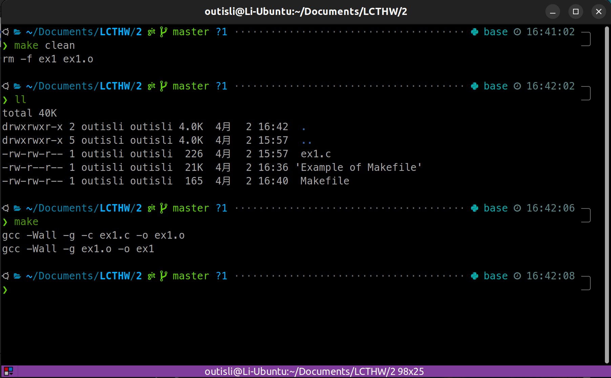

# 2024.04.02-练习 2：用 Make 来代替 Python

## 1. 使用 Make

```bash
make ex1
CFLAGS="-Wall" make ex1
```

第一个命令中你告诉 make，“我想创建名为 ex1 的文件”。于是 Make 执行下面的动作：

- 文件`ex1`存在吗？
- 没有。好的，有没有其他文件以`ex1`开头？
- 有，叫做`ex1.c`。我知道如何构建`.c`文件吗？
- 是的，我会运行命令`cc ex1.c -o ex1`来构建它。
- 我将使用`cc`从`ex1.c`文件来为你构建`ex1`。

上面列出的第二条命令是一种向 make 命令传递“修改器”的途径。如果你不熟悉 Unix shell 如何工作，你可以创建这些“环境变量”，它们会在程序运行时生效。有时你会用一条类似于`export CFLAGS="-Wall"`的命令来执行相同的事情，取决于你所用的 shell。然而你可以仅仅把它们放到你想执行的命令前面，于是环境变量只会在程序运行时有效。

在这个例子中我执行了`CFLAGS="-Wall" make ex1`，所以它会给 make 通常使用的`cc`命令添加`-Wall`选项。这行命令告诉`cc`编译器要报告所有的警告（然而实际上不可能报告所有警告）。

实际上你可以深入探索使用 make 的上述方法，但是先让我们来看看`Makefile`，以便让你对 make 了解得更多一点。首先，创建文件并写入以下内容：

```makefile
CFLAGS=-Wall -g

clean:
    rm -f ex1
```

将文件在你的当前文件夹上保存为`Makefile`。Make 会自动假设当前文件夹中有一个叫做`Makefile`的文件，并且会执行它。此外，一定要注意：确保你只输入了 TAB 字符，而不是空格和 TAB 的混合。

`Makefile`向你展示了 make 的一些新功能。首先我们在文件中设置`CFLAGS`，所以之后就不用再设置了。并且，我们添加了`-g`标识来获取调试信息。接着我们写了一个叫做`clean`的部分，它告诉 make 如何清理我们的小项目。

确保它和你的`ex1.c`文件在相同的目录中，之后运行以下命令：

```bash
make clean
make ex1
```

## 2. Makefile

### 2.1 语法规则

```bash
目标 ... : 依赖 ...
	命令1
	命令2
	. . .
```

Makefile 的核心规则，类似于一位厨神做菜，目标就是做好一道菜，那么所谓的依赖就是各种食材，各种厨具等等，然后需要厨师好的技术方法类似于命令，才能作出一道好菜。同时这些依赖也有可能此时并不存在，需要现场制作，或者是由其他厨师做好，那么这个依赖就成为了其他规则的目标，该目标也会有他自己的依赖和命令。这样就形成了一层一层递归依赖组成了 Makefile 文件。Makefile 并不会关心命令是如何执行的，仅仅只是会去执行所有定义的命令，和我们平时直接输入命令行是一样的效果。

1、目标即要生成的文件。如果目标文件的更新时间晚于依赖文件更新时间，则说明依赖文件没有改动，目标文件不需要重新编译。否则会进行重新编译并更新目标文件。

2、默认情况下 Makefile 的第一个目标为终极目标。

3、依赖：即目标文件由哪些文件生成。

4、命令：即通过执行命令由依赖文件生成目标文件。注意每条命令之前必须有一个 tab 保持缩进，这是语法要求（会有一些编辑工具默认 tab 为 4 个空格，会造成 Makefile 语法错误）。

5、all：Makefile 文件默认只生成第一个目标文件即完成编译，但是我们可以通过 all 指定所需要生成的目标文件。

### 2.2 变量

`$`符号表示取变量的值，当变量名多于一个字符时，使用"( )"

`$`符的其他用法

`$^` 表示所有的依赖文件

`$@` 表示生成的目标文件

`$<` 代表第一个依赖文件

```makefile
SRC = $(wildcard *.c)
OBJ = $(patsubst %.c, %.o, $(SRC))

ALL: hello.out

hello.out: $(OBJ)
        gcc $^ -o $@

$(OBJ): $(SRC)
        gcc -c $^ -o $@
```

### 2.3 变量赋值

1、"**=**"是最普通的等号，在 Makefile 中容易搞错赋值等号，使用 “=”进行赋值，变量的值是整个 Makefile 中最后被指定的值。

```makefile
VIR_A = A
VIR_B = $(VIR_A) B
VIR_A = AA
```

经过上面的赋值后，最后 VIR_B 的值是 AA B，而不是 A B，在 make 时，会把整个 Makefile 展开，来决定变量的值

2、"**:=**" 表示直接赋值，赋予当前位置的值。

```makefile
VIR_A := A
VIR_B := $(VIR_A) B
VIR_A := AA
```

最后 BIR_B 的值是 A B，即根据当前位置进行赋值。因此相当于“=”，“：=”才是真正意义上的直接赋值

3、"**?=**" 表示如果该变量没有被赋值，赋值予等号后面的值。

```makefile
VIR ?= new_value
```

如果 VIR 在之前没有被赋值，那么 VIR 的值就为 new_value。

```makefile
VIR := old_value
VIR ?= new_value
```

这种情况下，VIR 的值就是 old_value

4、"**+=**"和平时写代码的理解是一样的，表示将符号后面的值添加到前面的变量上

### 2.4 预定义变量

CC：c 编译器的名称，默认值为 cc。cpp c 预编译器的名称默认值为$(CC) -E

```makefile
CC = gcc
```

回显问题，Makefile 中的命令都会被打印出来。如果不想打印命令部分 可以使用@去除回显

```makefile
@echo "clean done!"
```

`@`符号：在`Makefile`中，当你在命令行前加上`@`符号，它告诉`make`在执行这个命令时不要将命令本身输出到标准输出（即不在控制台显示命令）。通常，`make`会打印每个命令到标准输出，然后执行它。通过在命令前加上`@`符号，你可以避免显示命令，只显示命令的输出或者执行结果。这可以让你的构建输出看起来更简洁。

### 2.5 函数

通配符 `SRC = $(wildcard ./*.c)` 匹配目录下所有.c 文件，并将其赋值给 SRC 变量。

`OBJ = $(patsubst %.c, %.o, $(SRC))` 这个函数有三个参数，意思是取出 SRC 中的所有值，然后将.c 替换为.o 最后赋值给 OBJ 变量。

示例：如果目录下有很多个.c 源文件，就不需要写很多条规则语句了，而是可以像下面这样写

```makefile
SRC = $(wildcard *.c)
OBJ = $(patsubst %.c, %.o, $(SRC))

ALL: hello.out

hello.out: $(OBJ)
        gcc $(OBJ) -o hello.out

$(OBJ): $(SRC)
        gcc -c $(SRC) -o $(OBJ)
```

这里先将所有.c 文件编译为 .o 文件，这样后面更改某个 .c 文件时，其他的 .c 文件将不在编译，而只是编译有更改的 .c 文件，可以大大提高大项目中的编译速度。

### 2.6 伪目标 .PHONY

伪目标只是一个标签，clean 是个伪目标没有依赖文件，只有用 make 来调用时才会执行

当目录下有与 make 命令 同名的文件时 执行 make 命令就会出现错误。

解决办法就是使用伪目标

```makefile
SRC = $(wildcard *.c)
OBJ = $(patsubst %.c, %.o, $(SRC))

ALL: hello.out

hello.out: $(OBJ)
        gcc $< -o $@

$(OBJ): $(SRC)
        gcc -c $< -o $@

clean:
        rm -rf $(OBJ) hello.out

.PHONY: clean ALL
```

通常也会把 ALL 设置成伪目标

### 2.7 其他常用功能

代码清理 clean

我们可以编译一条属于自己的 clean 语句，来清理 make 命令所产生的所有文件，列如

```makefile
SRC = $(wildcard *.c)
OBJ = $(patsubst %.c, %.o, $(SRC))

ALL: hello.out

hello.out: $(OBJ)
        gcc $< -o $@

$(OBJ): $(SRC)
        gcc -c $< -o $@

clean:
        rm -rf $(OBJ) hello.out
```

### 2.8 嵌套执行 Makefile

在一些大工程中，会把不同模块或不同功能的源文件放在不同的目录中，我们可以在每个目录中都写一个该目录的 Makefile 这有利于让我们的 Makefile 变的更加简洁，不至于把所有东西全部写在一个 Makefile 中。

列如在子目录 subdir 目录下有个 Makefile 文件，来指明这个目录下文件的编译规则。外部总 Makefile 可以这样写

```makefile
subsystem:
            cd subdir && $(MAKE)
其等价于：
subsystem:
            $(MAKE) -C subdir
```

定义$(MAKE)宏变量的意思是，也许我们的 make 需要一些参数，所以定义成一个变量比较有利于维护。两个例子意思都是先进入"subdir"目录，然后执行 make 命令

我们把这个 Makefile 叫做总控 Makefile，总控 Makefile 的变量可以传递到下级的 Makefile 中，但是不会覆盖下层 Makefile 中所定义的变量，除非指定了 "-e"参数。

如果传递变量到下级 Makefile 中，那么可以使用这样的声明 `export` 如果不想让某些变量传递到下级 Makefile，可以使用 `unexport`

```makefile
export variable = value
等价于
variable = value
export variable
等价于
export variable := value
等价于
variable := value
export variable
如果需要传递所有变量，那么只要一个export就行了。后面什么也不用跟，表示传递所有变量
```

### 2.9 指定头文件路径

一般都是通过"**-I**"（大写 i）来指定，假设头文件在： `/home/develop/include`

则可以通过-I 指定： `-I/home/develop/include` 将该目录添加到头文件搜索路径中

在 Makefile 中则可以这样写：

```makefile
CFLAGS=-I/home/develop/include
```

然后在编译的时候，引用 CFLAGS 即可，如下

```makefile
yourapp:*.c
    gcc $(CFLAGS) -o yourapp
```

## 3. 附加题

### 3.1 创建目标`all:ex1`，可以以单个命令`make`构建`ex1`



```makefile
CC=gcc

CFLAGS=-Wall -g

all:ex1

ex1:ex1.o
	$(CC) $(CFLAGS) ex1.o -o ex1

ex1.o:ex1.c
	$(CC) $(CFLAGS) -c ex1.c -o ex1.o

clean:
	rm -f ex1 ex1.o
.PHONY: all clean
```

### 3.2 阅读`man cc`来了解关于`-Wall`和`-g`行为的更多信息

**-Wall**

- `Wall`是一个编译器选项，代表“warn all”，告诉编译器产生尽可能多的警告信息。尽管名称暗示它会启用所有警告，实际上它只启用了最常见的一组警告。这些警告可以帮助开发者发现代码中的潜在问题，比如变量未使用、可能的数据类型不匹配、未初始化的变量等。
- 使用`Wall`是一种很好的做法，因为它可以帮助你提前识别潜在的错误或不一致，从而提高代码质量。在开发过程中，尽量解决所有`Wall`引发的警告，可以避免未来发生更复杂的问题。

**-g**

- `g`选项用于在编译时生成调试信息。这些调试信息包括了程序中的变量、函数、类等符号的名称和类型信息，以及它们在源代码中的位置。这使得调试器（如 GDB）能够理解程序的结构，允许开发者进行断点调试、单步执行、查看变量值等调试操作。
- 在不使用`g`选项的情况下编译的程序仍然可以运行，但如果需要调试，缺少调试信息会让这一过程变得非常困难。因此，开发阶段建议总是加上`g`选项来编译程序，以便在遇到问题时能够更容易地调试。
- 需要注意的是，添加`g`选项编译的程序会因为包含了额外的调试信息而变得更大。在发布产品时，通常会移除调试信息（不使用`g`选项或使用像`s`这样的选项来剔除调试信息），以减小程序的大小和提高运行时性能。
