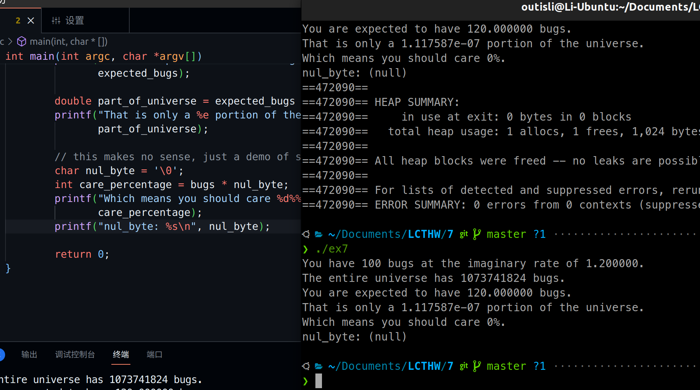
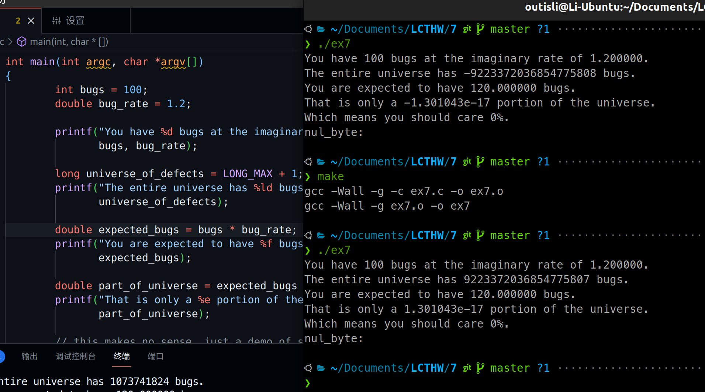
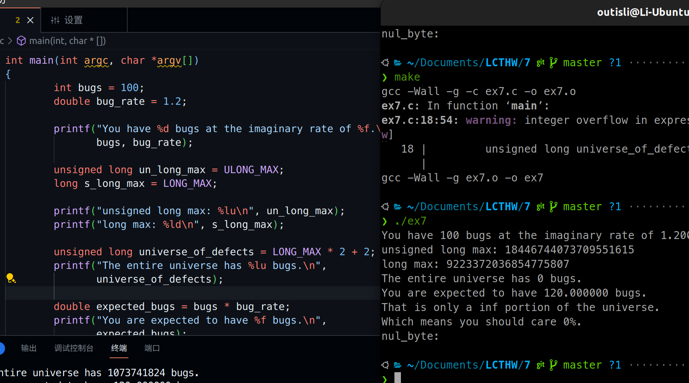
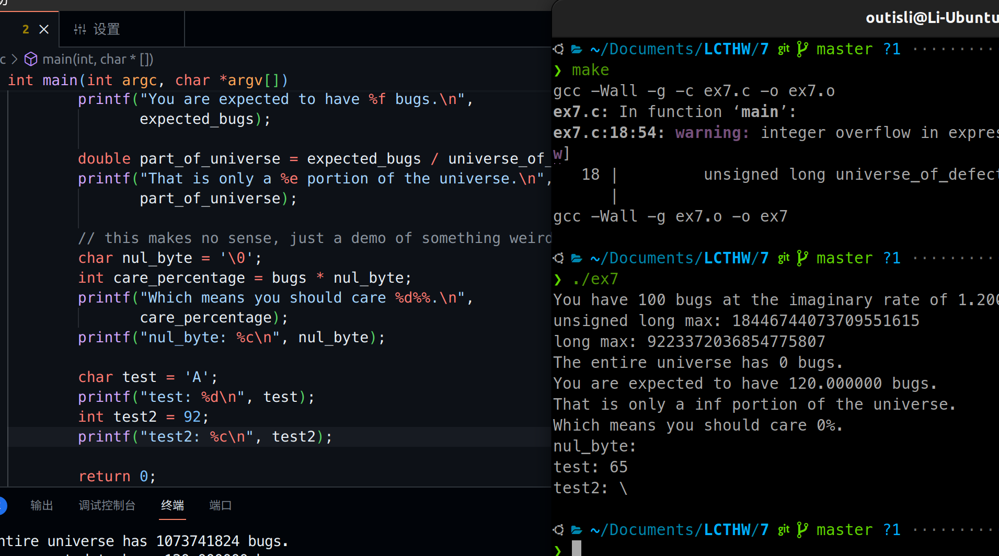

# 2024.04.03-练习7：更多变量和一些算术

## 1. 基本算术操作

```c
int main(int argc, char *argv[])
{
    int bugs = 100;
    double bug_rate = 1.2;

    printf("You have %d bugs at the imaginary rate of %f.\n",
            bugs, bug_rate);

    long universe_of_defects = 1L * 1024L * 1024L * 1024L;
    printf("The entire universe has %ld bugs.\n",
            universe_of_defects);

    double expected_bugs = bugs * bug_rate;
    printf("You are expected to have %f bugs.\n",
            expected_bugs);

    double part_of_universe = expected_bugs / universe_of_defects;
    printf("That is only a %e portion of the universe.\n",
            part_of_universe);

    // this makes no sense, just a demo of something weird
    char nul_byte = '\0';
    int care_percentage = bugs * nul_byte;
    printf("Which means you should care %d%%.\n",
            care_percentage);

    return 0;
}
```

以特殊的语法`'\0'`声明了一个字符。这样创建了一个“空字节”字符，实际上是数字0。

## 2. 用%s打印\0



## 3. 附加题

### 3.1 LONG_MAX



会发生溢出，到负的那边循环

### 3.2 ULONG_MAX



unsigned的范围是signed的最大值的两倍加一

### 3.3 char & int



因为char字符都有ASCII编码，所以可以被认为是int