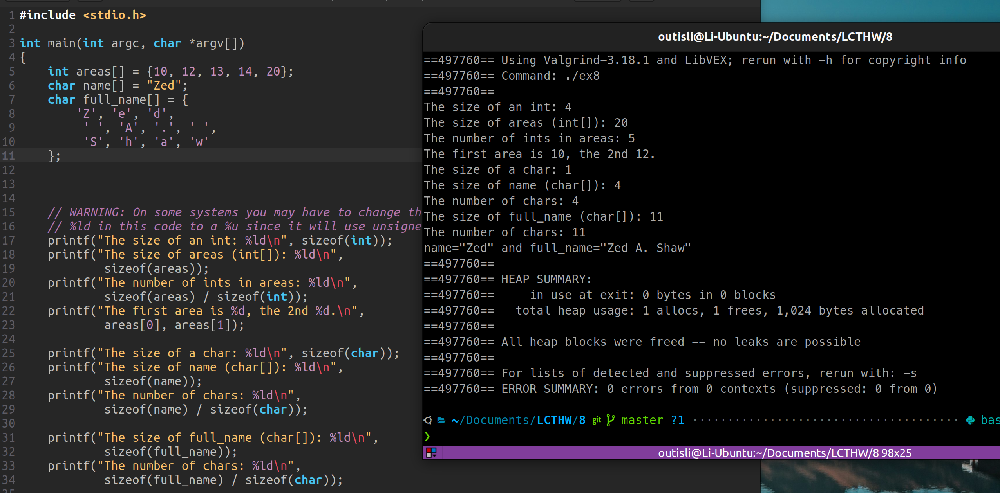
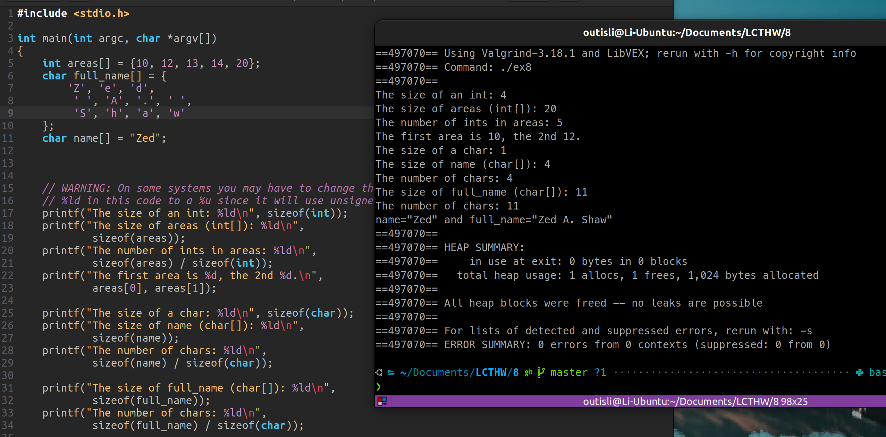
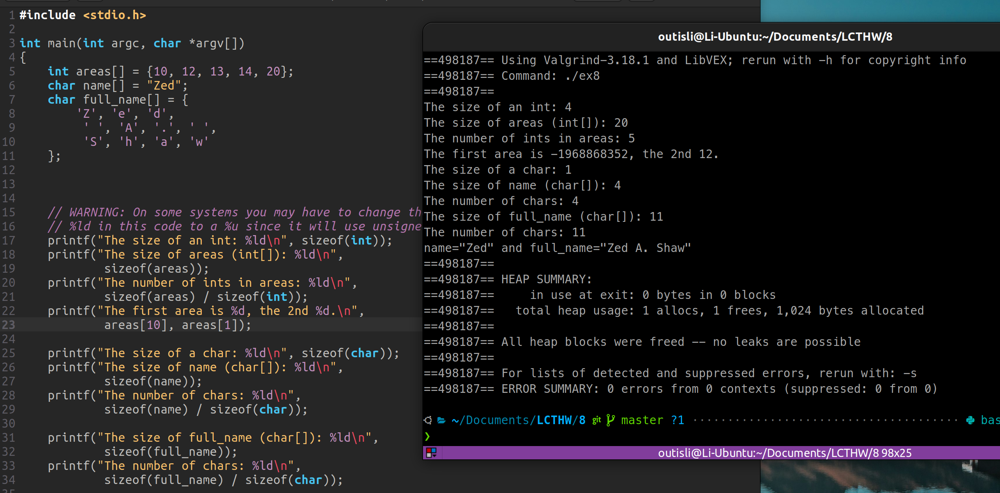
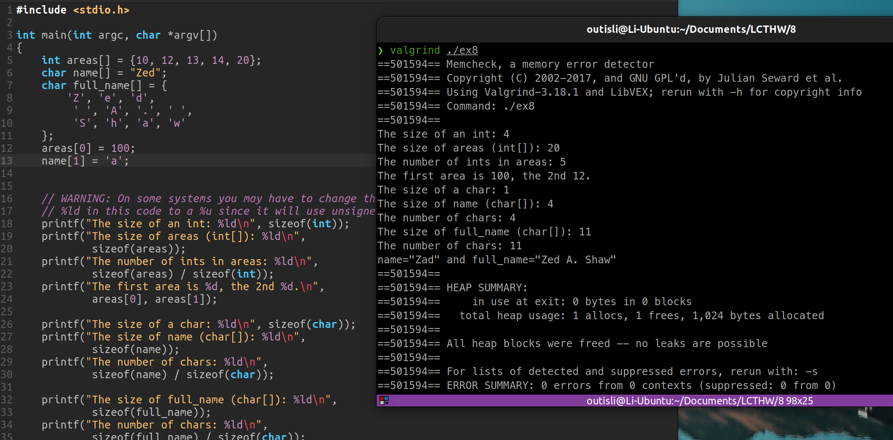
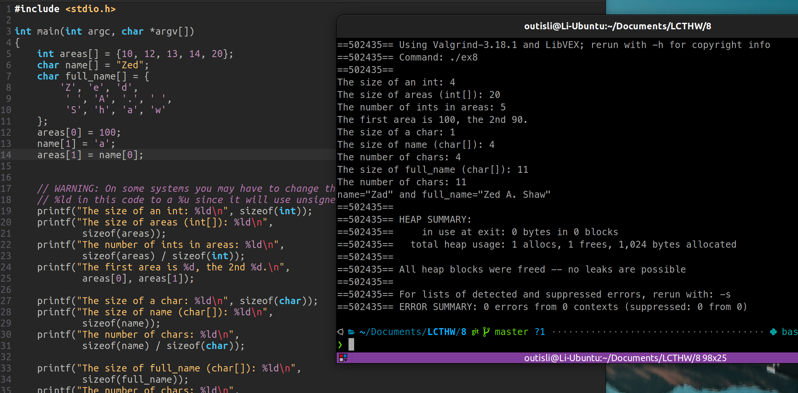

# 2024.04.03-练习8：大小和数组

## 1. `sizeof`和数组

```c
#include <stdio.h>

int main(int argc, char *argv[])
{
    int areas[] = {10, 12, 13, 14, 20};
    char name[] = "Zed";
    char full_name[] = {
        'Z', 'e', 'd',
         ' ', 'A', '.', ' ',
         'S', 'h', 'a', 'w', '\0'
    };

    // WARNING: On some systems you may have to change the
    // %ld in this code to a %u since it will use unsigned ints
    printf("The size of an int: %ld\n", sizeof(int));
    printf("The size of areas (int[]): %ld\n",
            sizeof(areas));
    printf("The number of ints in areas: %ld\n",
            sizeof(areas) / sizeof(int));
    printf("The first area is %d, the 2nd %d.\n",
            areas[0], areas[1]);

    printf("The size of a char: %ld\n", sizeof(char));
    printf("The size of name (char[]): %ld\n",
            sizeof(name));
    printf("The number of chars: %ld\n",
            sizeof(name) / sizeof(char));

    printf("The size of full_name (char[]): %ld\n",
            sizeof(full_name));
    printf("The number of chars: %ld\n",
            sizeof(full_name) / sizeof(char));

    printf("name=\"%s\" and full_name=\"%s\"\n",
            name, full_name);

    return 0;
}
```

## 2. 如何使它崩溃

### 2.1 将`full_name`最后的`'\0'`去掉





1. **无`\0`终止符的后果**：标准的字符串处理函数（如`printf`的`%s`格式化输出、`strcpy`、`strlen`等）期望字符串以`\0`终止。如果省略了`\0`，这些函数会继续读取内存，直到偶然遇到一个`\0`字节。这可能导致读取数组后面的内存，结果是不可预测的，可能会导致错误的输出、内存访问违规、甚至是程序崩溃。
2. **为什么没有立即出错**：在实际使用中，如果紧接在字符数组后面的内存恰好是零（可能由于内存的初始状态或者其他变量的影响），那么使用字符串相关函数时可能看起来"运行正常"。但这是纯粹偶然的，并不可靠。随着程序的运行，内存布局的变化可能会改变这一状况，从而引发难以预测的错误。

### 2.2 将`areas[0]`改为`areas[10]`



会打印出一个随机数

## 3. 附加题

### 3.1 对`areas`的元素赋值


### 3.2 对`name`的元素赋值



### 3.3 将`areas`的一个元素赋值为`name`中的字符



### 3.4 C语言中不同的CPU上整数所占的不同大小

**1. 32位系统（如x86）**

在32位系统上，通常遵循ILP32数据模型，其中：

- `int` 通常是32位（4字节）。
- `short` 通常是16位（2字节）。
- `long` 也通常是32位（4字节）。
- `long long` 保证至少是64位（8字节）。
- 指针大小是32位（4字节）。

**2. 64位系统（如x86_64或AMD64）**

在64位系统上，最常见的数据模型是LP64，其中：

- `int` 保持32位（4字节）。
- `short` 仍然是16位（2字节）。
- `long` 和指针的大小增加到64位（8字节）。
- `long long` 保证至少是64位（8字节）。

另一个在某些64位系统（如Windows的64位版本）上使用的数据模型是LLP64，它保持`long`为32位，而只有指针和`long long`是64位。