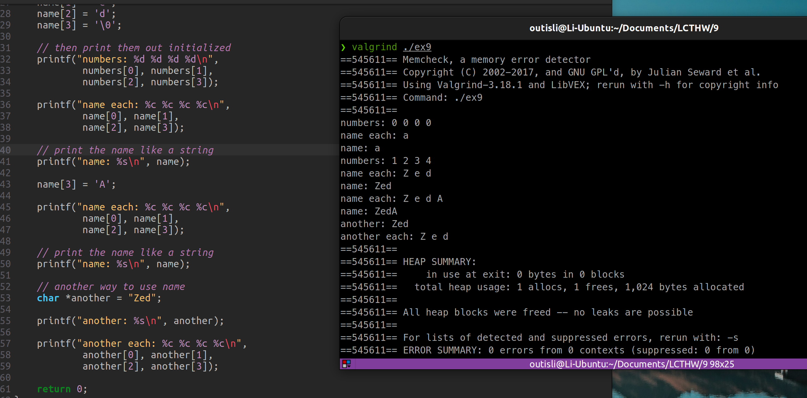
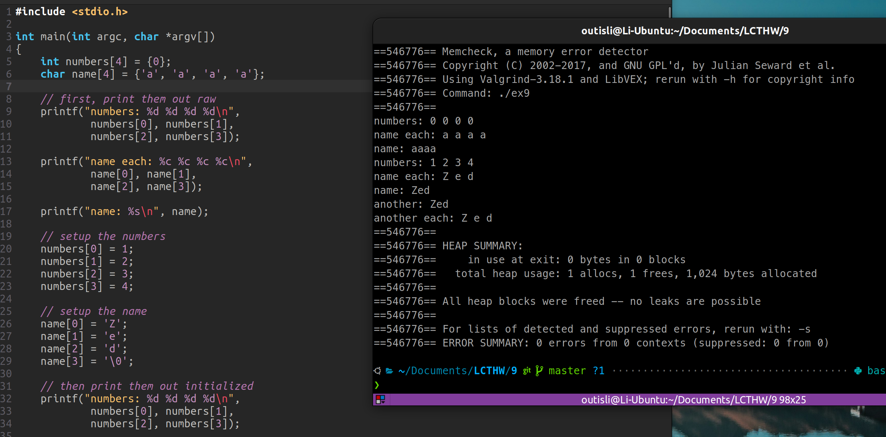
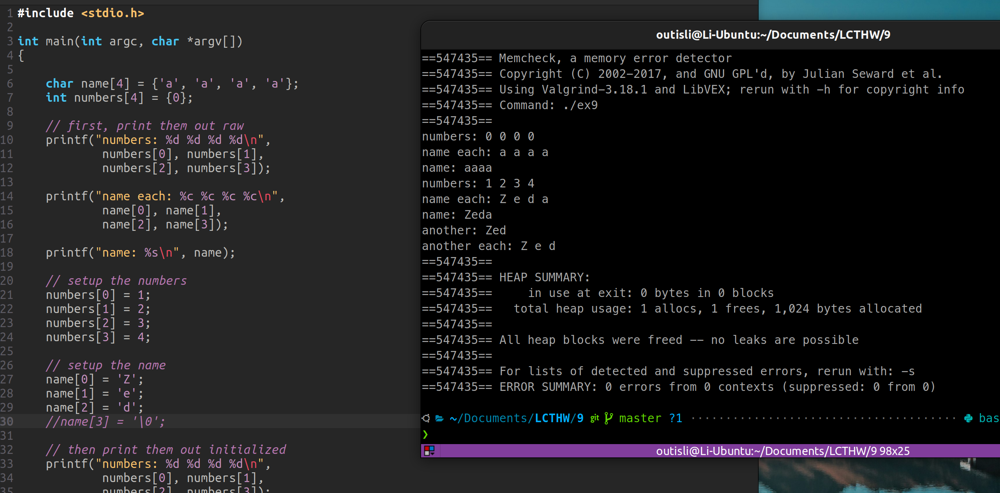
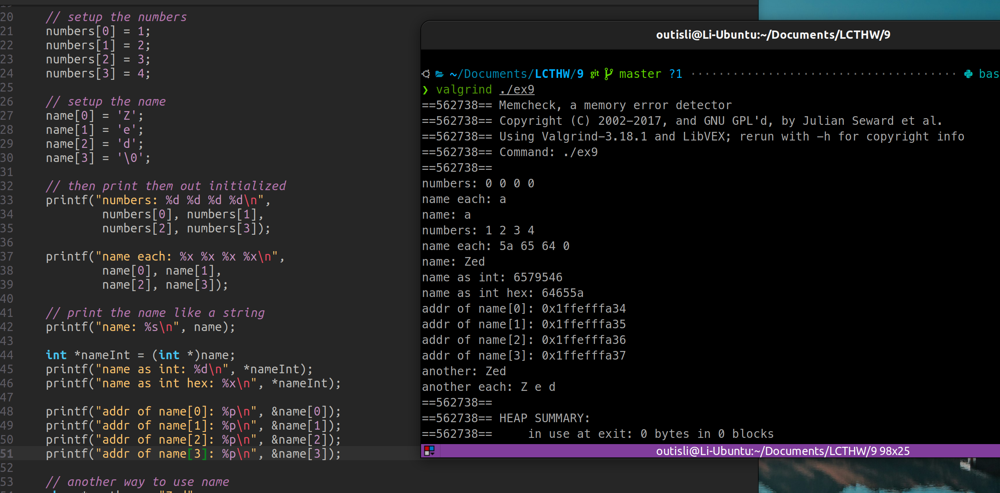

# 2024.04.03-练习9：数组和字符串

## 1. 字符数组

```c
#include <stdio.h>

int main(int argc, char *argv[])
{
    int numbers[4] = {0};
    char name[4] = {'a'};

    // first, print them out raw
    printf("numbers: %d %d %d %d\n",
            numbers[0], numbers[1],
            numbers[2], numbers[3]);

    printf("name each: %c %c %c %c\n",
            name[0], name[1],
            name[2], name[3]);

    printf("name: %s\n", name);

    // setup the numbers
    numbers[0] = 1;
    numbers[1] = 2;
    numbers[2] = 3;
    numbers[3] = 4;

    // setup the name
    name[0] = 'Z';
    name[1] = 'e';
    name[2] = 'd';
    name[3] = '\0';

    // then print them out initialized
    printf("numbers: %d %d %d %d\n",
            numbers[0], numbers[1],
            numbers[2], numbers[3]);

    printf("name each: %c %c %c %c\n",
            name[0], name[1],
            name[2], name[3]);

    // print the name like a string
    printf("name: %s\n", name);

    // another way to use name
    char *another = "Zed";

    printf("another: %s\n", another);

    printf("another each: %c %c %c %c\n",
            another[0], another[1],
            another[2], another[3]);

    return 0;
}
```

## 2. 使其崩溃

### 2.1 删掉`name`的初始化表达式

error

### 2.2 设置`name[3] = 'A'`



### 2.3 初始化表达式设置为`{'a','a','a','a'}`





## 3. 附加题

### 3.1 字符赋给`numbers`的元素

当用`%c`格式化字符串来打印一个`int`值时，编译器通常不会发出警告，因为`%c`期望一个`int`类型的参数（在大多数情况下，字符在传递给函数时会被提升为`int`）。然而，如果数组中的整数值不对应于有效的ASCII字符编码，则打印的结果可能是乱码或不可预测的字符。

### 3.2 把`names`当成`int`数组

使用`%d`格式化字符串来打印时，如果直接传递`char`类型的值给`printf`，由于`char`到`int`的隐式类型提升，这种类型不匹配通常不会导致编译器警告。但是，如果尝试直接以`int`数组的方式访问`char`数组（如通过类型转换或指针操作），并尝试打印，这将导致未定义的行为，特别是当`char`数组的大小小于`int`时。

### 3.3

如果一个字符数组占四个字节，一个整数也占4个字节，你可以像整数一样使用整个name吗？你如何用黑魔法实现它？



`Zed\0` 的ASCII码对应的十六进制分别是5a，65，64，0.然后考虑到计算机是小端序，所以name存储时最低位存的是Z，所以综合起来存储的就是0064655a，十进制就是6579546