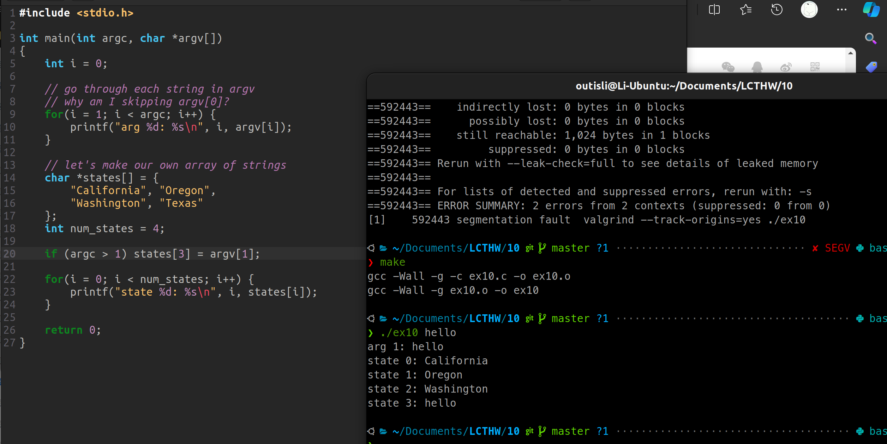

# 2024.04.04-练习10：字符串数组和循环

## 1. **字符串数组**

```c
#include <stdio.h>

int main(int argc, char *argv[])
{
    int i = 0;

    // go through each string in argv
    // why am I skipping argv[0]?
    for(i = 1; i < argc; i++) {
        printf("arg %d: %s\n", i, argv[i]);
    }

    // let's make our own array of strings
    char *states[] = {
        "California", "Oregon",
        "Washington", "Texas"
    };
    int num_states = 4;

    for(i = 0; i < num_states; i++) {
        printf("state %d: %s\n", i, states[i]);
    }

    return 0;
}
```

`argv[0]` 是程序的名称

如果 num_states 大于4，会报段错误，因为这些索引超出了数组 `states` ****的初始化范围，它们没有被初始化指向任何有效的字符串。

## 2. 附加题

### 2.1 在`for`循环的每一部分可以放置什么代码

1. 初始化表达式

- 这部分在循环开始前执行一次。
- 常用于初始化循环控制变量。
- 可以定义一个或多个变量（C99标准之后），也可以是空操作，如果没有需要初始化的变量。
- 可以执行任何有效的赋值操作或函数调用。

2. 条件表达式

- 这部分在每次循环迭代之前评估。
- 决定是否执行循环体。
- 必须是能够评估为布尔值的表达式。如果表达式结果为`true`（非零），循环继续；如果为`false`（零），循环结束。
- 可以是复杂的表达式，包含逻辑和关系运算符。

3. 循环后表达式

- 这部分在每次循环迭代的末尾执行，即循环体执行完毕后。
- 通常用于更新循环控制变量。
- 可以执行多个更新操作，使用逗号运算符分隔。

### 2.2 `for` 循环中的逗号

```c
for (int i = 0, j = 10; i < j; i++, j--) {}
```

### 2.3 `NULL`

在C语言中，`NULL`是一个宏，通常用来表示指针不指向任何有效的对象或位置。它在多个头文件中被定义，如`<stddef.h>`、`<stdio.h>`、`<stdlib.h>`等，通常被定义为`((void *)0)`，即一个类型为`void*`的空指针。

将`NULL`用作字符指针数组`states`的一个元素，相当于在数组中插入一个不指向任何有效字符串的指针。在打印时，尝试访问这个`NULL`指针所指向的字符串将触发未定义行为（Undefined Behavior, UB），因为试图访问一个不存在的内存位置。在大多数情况下，这可能会导致程序崩溃，因为`printf`的`%s`格式化选项期望一个指向有效C字符串的指针。

### 2.4

