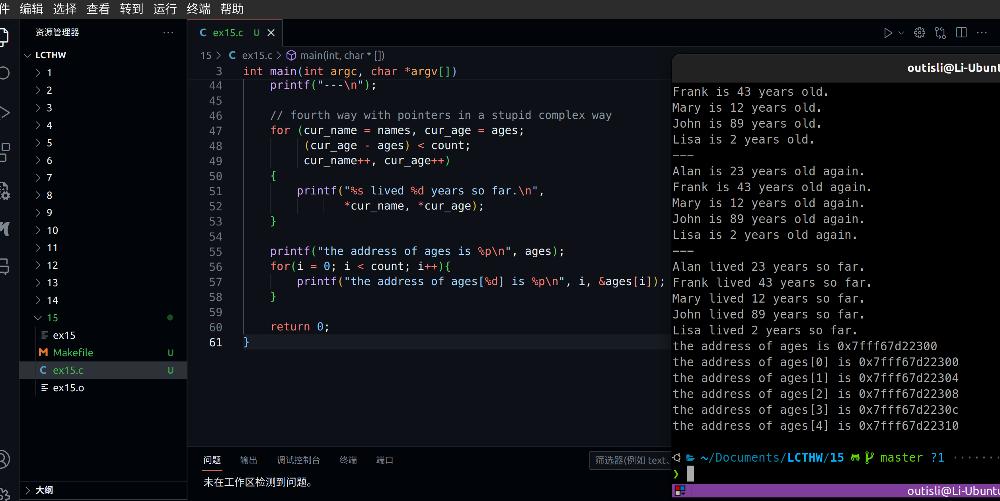
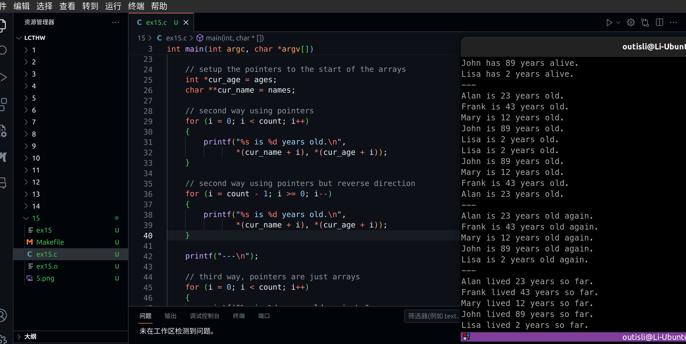

# 2024.04.05-练习15：指针，可怕的指针

## 1. 指针

```c
#include <stdio.h>

int main(int argc, char *argv[])
{
    // create two arrays we care about
    int ages[] = {23, 43, 12, 89, 2};
    char *names[] = {
        "Alan", "Frank",
        "Mary", "John", "Lisa"
    };

    // safely get the size of ages
    int count = sizeof(ages) / sizeof(int);
    int i = 0;

    // first way using indexing
    for(i = 0; i < count; i++) {
        printf("%s has %d years alive.\n",
                names[i], ages[i]);
    }

    printf("---\n");

    // setup the pointers to the start of the arrays
    int *cur_age = ages;
    char **cur_name = names;

    // second way using pointers
    for(i = 0; i < count; i++) {
        printf("%s is %d years old.\n",
                *(cur_name+i), *(cur_age+i));
    }

    printf("---\n");

    // third way, pointers are just arrays
    for(i = 0; i < count; i++) {
        printf("%s is %d years old again.\n",
                cur_name[i], cur_age[i]);
    }

    printf("---\n");

    // fourth way with pointers in a stupid complex way
    for(cur_name = names, cur_age = ages;
            (cur_age - ages) < count;
            cur_name++, cur_age++)
    {
        printf("%s lived %d years so far.\n",
                *cur_name, *cur_age);
    }

    return 0;
}
```

`char ** list;` 那么`list`是指向第一个字符串指针的指针。访问第一个字符串的第二个字符，可以使用表达式 `*(*(list) + 1)`。

## 2. 实用的指针用法

你可以用指针做下面四个最基本的操作：

- 向OS申请一块内存，并且用指针处理它。这包括字符串，和一些你从来没见过的东西，比如结构体。
- 通过指针向函数传递大块的内存（比如很大的结构体），这样不必把全部数据都传递进去。
- 获取函数的地址用于动态调用。
- 对一块内存做复杂的搜索，比如，转换网络套接字中的字节，或者解析文件。

对于你看到的其它所有情况，实际上应当使用数组。在早期，由于编译器不擅长优化数组，人们使用指针来加速它们的程序。然而，现在访问数组和指针的语法都会翻译成相同的机器码，并且表现一致。由此，你应该每次尽可能使用数组，并且按需将指针用作提升性能的手段。

## 3. 指针词库

现在我打算向你提供一个词库，用于读写指针。当你遇到复杂的指针语句时，试着参考它并且逐字拆分语句（或者不要使用这个语句，因为有可能并不好）：

`type *ptr` : `type`类型的指针，名为`ptr`。

- `*ptr` : `ptr`所指向位置的值。
- `*(ptr + i)` : （`ptr`所指向位置加上`i`）的值。

> 译者注：以字节为单位的话，应该是ptr所指向的位置再加上`sizeof(type) * i`。
> 

`&thing` : `thing`的地址。

`type *ptr = &thing` : 名为`ptr`，`type`类型的指针，值设置为`thing`的地址。 `ptr++` 自增`ptr`指向的位置。

## 4. 指针并不是数组

无论怎么样，你都不应该把指针和数组混为一谈。它们并不是相同的东西，即使C让你以一些相同的方法来使用它们。例如，如果你访问上面代码中的`sizeof(cur_age)`，你会得到指针的大小，而不是它指向数组的大小。如果你想得到整个数组的大小，你应该使用数组的名称`age`，就像第12行那样。

译者注，除了`sizeof`、`&`操作和声明之外，数组名称都会被编译器推导为指向其首个元素的指针。对于这些情况，不要用“是”这个词，而是要用“推导”。

## 5. 附加题

## 5.1 获取地址



### 5.2 倒序遍历

