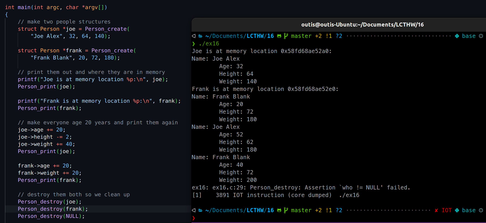
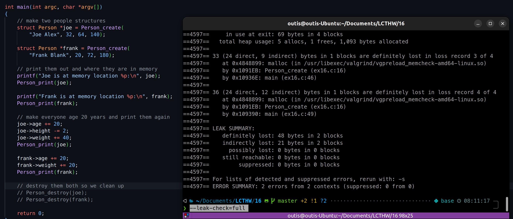
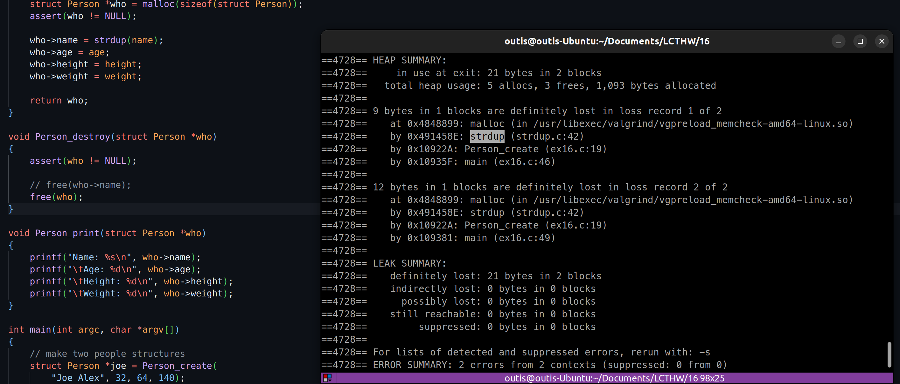
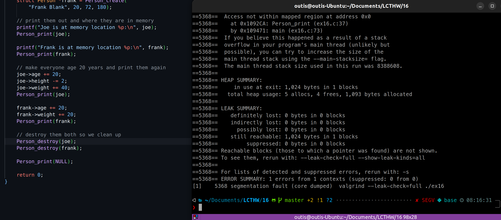
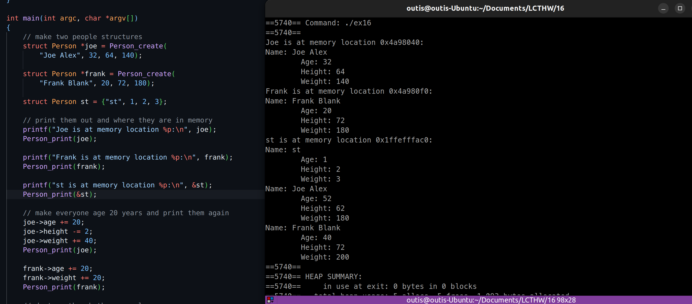

# 2024.04.05-练习16：结构体和指向它们的指针

## 1. struct

```c
#include <stdio.h>
#include <assert.h>
#include <stdlib.h>
#include <string.h>

struct Person {
    char *name;
    int age;
    int height;
    int weight;
};

struct Person *Person_create(char *name, int age, int height, int weight)
{
    struct Person *who = malloc(sizeof(struct Person));
    assert(who != NULL);

    who->name = strdup(name);
    who->age = age;
    who->height = height;
    who->weight = weight;

    return who;
}

void Person_destroy(struct Person *who)
{
    assert(who != NULL);

    free(who->name);
    free(who);
}

void Person_print(struct Person *who)
{
    printf("Name: %s\n", who->name);
    printf("\tAge: %d\n", who->age);
    printf("\tHeight: %d\n", who->height);
    printf("\tWeight: %d\n", who->weight);
}

int main(int argc, char *argv[])
{
    // make two people structures
    struct Person *joe = Person_create(
            "Joe Alex", 32, 64, 140);

    struct Person *frank = Person_create(
            "Frank Blank", 20, 72, 180);

    // print them out and where they are in memory
    printf("Joe is at memory location %p:\n", joe);
    Person_print(joe);

    printf("Frank is at memory location %p:\n", frank);
    Person_print(frank);

    // make everyone age 20 years and print them again
    joe->age += 20;
    joe->height -= 2;
    joe->weight += 40;
    Person_print(joe);

    frank->age += 20;
    frank->weight += 20;
    Person_print(frank);

    // destroy them both so we clean up
    Person_destroy(joe);
    Person_destroy(frank);

    return 0;
}
```

使用`strdup`来复制字符串`name`，是为了确保结构体真正拥有它。`strdup`的行为实际上类似`malloc`但是它同时会将原来的字符串复制到新创建的内存。

!!!如果结构体有指针类型成员,同时结构体在堆中创建的,那么释放堆中结构体之前需要提前释放结构体中的指针成员指向的内存,然后再释放结构体自身的。

## 2. 使它崩溃

### 2.1 `assert(who != NULL);`

试着传递`NULL`给`Person_destroy`来看看会发生什么。如果它没有崩溃，你必须移除Makefile的`CFLAGS`中的`g`选项。



### 2.2 内存泄漏

在结尾处忘记调用`Person_destroy`，在`Valgrind`下运行程序，你会看到它报告出你忘记释放内存。弄清楚你应该向`valgrind`传递什么参数来让它向你报告内存如何泄露。



### 2.3 单独释放结构体中的指针

忘记在`Person_destroy`中释放`who->name`，并且对比两次的输出。同时，使用正确的选项来让`Valgrind`告诉你哪里错了。



### 2.4 获取NULL

这一次，向`Person_print`传递`NULL`，并且观察`Valgrind`会输出什么。



## 3. 附加题

### 3.1 在栈上创建结构体

