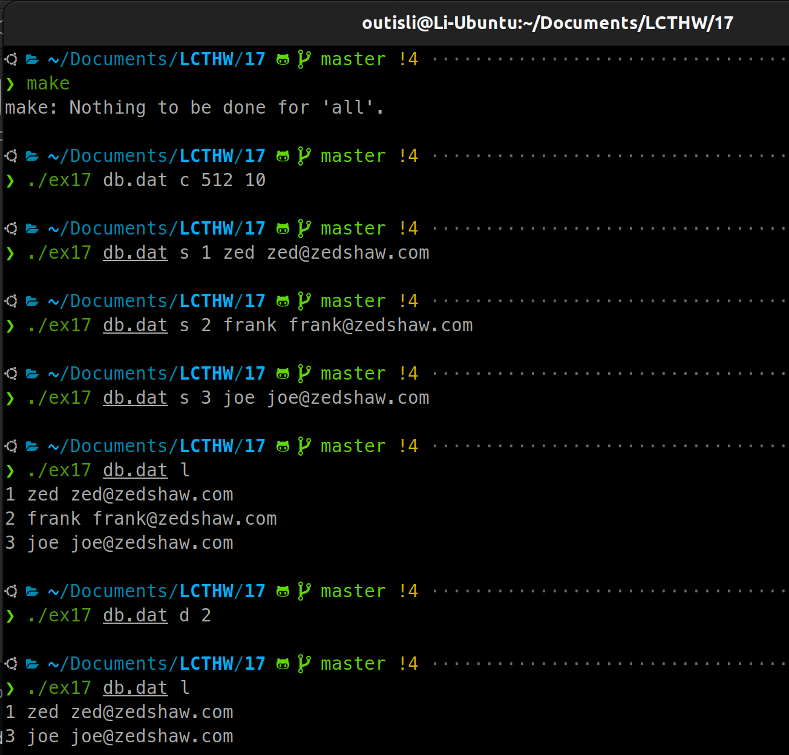
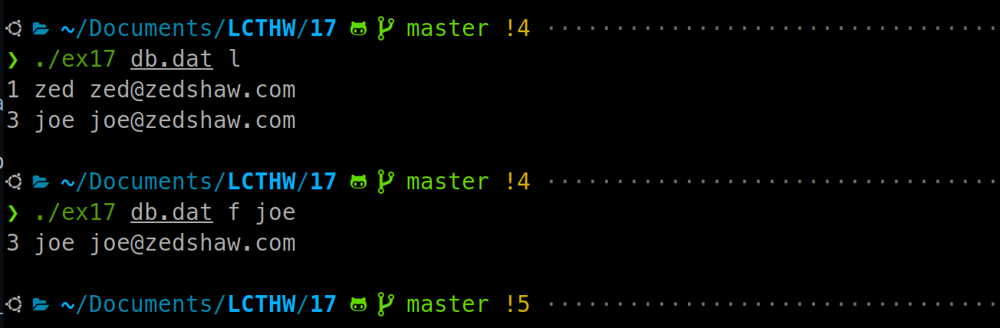

# 2024.04.08-练习17：堆和栈的内存分配

## 1. Program

```c
#include <stdio.h>
#include <assert.h>
#include <stdlib.h>
#include <errno.h>
#include <string.h>

#define MAX_DATA 512
#define MAX_ROWS 100

struct Address {
    int id;
    int set;
    char name[MAX_DATA];
    char email[MAX_DATA];
};

struct Database {
    struct Address rows[MAX_ROWS];
};

struct Connection {
    FILE *file;
    struct Database *db;
};

void die(const char *message)
{
    if(errno) {
        perror(message);
    } else {
        printf("ERROR: %s\n", message);
    }

    exit(1);
}

void Address_print(struct Address *addr)
{
    printf("%d %s %s\n",
            addr->id, addr->name, addr->email);
}

void Database_load(struct Connection *conn)
{
    int rc = fread(conn->db, sizeof(struct Database), 1, conn->file);
    if(rc != 1) die("Failed to load database.");
}

struct Connection *Database_open(const char *filename, char mode)
{
    struct Connection *conn = malloc(sizeof(struct Connection));
    if(!conn) die("Memory error");

    conn->db = malloc(sizeof(struct Database));
    if(!conn->db) die("Memory error");

    if(mode == 'c') {
        conn->file = fopen(filename, "w");
    } else {
        conn->file = fopen(filename, "r+");

        if(conn->file) {
            Database_load(conn);
        }
    }

    if(!conn->file) die("Failed to open the file");

    return conn;
}

void Database_close(struct Connection *conn)
{
    if(conn) {
        if(conn->file) fclose(conn->file);
        if(conn->db) free(conn->db);
        free(conn);
    }
}

void Database_write(struct Connection *conn)
{
    rewind(conn->file);

    int rc = fwrite(conn->db, sizeof(struct Database), 1, conn->file);
    if(rc != 1) die("Failed to write database.");

    rc = fflush(conn->file);
    if(rc == -1) die("Cannot flush database.");
}

void Database_create(struct Connection *conn)
{
    int i = 0;

    for(i = 0; i < MAX_ROWS; i++) {
        // make a prototype to initialize it
        struct Address addr = {.id = i, .set = 0};
        // then just assign it
        conn->db->rows[i] = addr;
    }
}

void Database_set(struct Connection *conn, int id, const char *name, const char *email)
{
    struct Address *addr = &conn->db->rows[id];
    if(addr->set) die("Already set, delete it first");

    addr->set = 1;
    // WARNING: bug, read the "How To Break It" and fix this
    char *res = strncpy(addr->name, name, MAX_DATA);
    // demonstrate the strncpy bug
    if(!res) die("Name copy failed");

    res = strncpy(addr->email, email, MAX_DATA);
    if(!res) die("Email copy failed");
}

void Database_get(struct Connection *conn, int id)
{
    struct Address *addr = &conn->db->rows[id];

    if(addr->set) {
        Address_print(addr);
    } else {
        die("ID is not set");
    }
}

void Database_delete(struct Connection *conn, int id)
{
    struct Address addr = {.id = id, .set = 0};
    conn->db->rows[id] = addr;
}

void Database_list(struct Connection *conn)
{
    int i = 0;
    struct Database *db = conn->db;

    for(i = 0; i < MAX_ROWS; i++) {
        struct Address *cur = &db->rows[i];

        if(cur->set) {
            Address_print(cur);
        }
    }
}

int main(int argc, char *argv[])
{
    if(argc < 3) die("USAGE: ex17 <dbfile> <action> [action params]");

    char *filename = argv[1];
    char action = argv[2][0];
    struct Connection *conn = Database_open(filename, action);
    int id = 0;

    if(argc > 3) id = atoi(argv[3]);
    if(id >= MAX_ROWS) die("There's not that many records.");

    switch(action) {
        case 'c':
            Database_create(conn);
            Database_write(conn);
            break;

        case 'g':
            if(argc != 4) die("Need an id to get");

            Database_get(conn, id);
            break;

        case 's':
            if(argc != 6) die("Need id, name, email to set");

            Database_set(conn, id, argv[4], argv[5]);
            Database_write(conn);
            break;

        case 'd':
            if(argc != 4) die("Need id to delete");

            Database_delete(conn, id);
            Database_write(conn);
            break;

        case 'l':
            Database_list(conn);
            break;
        default:
            die("Invalid action, only: c=create, g=get, s=set, d=del, l=list");
    }

    Database_close(conn);

    return 0;
}
```

`#define` **常量**

我使用了“C预处理器”的另外一部分，来创建`MAX_DATA`和`MAX_ROWS`的设置常量。我之后会更多地讲解预处理器的功能，不过这是一个创建可靠的常量的简易方法。除此之外还有另一种方法，但是在特定场景下并不适用。

**定长结构体**

`Address`结构体接着使用这些常量来创建数据，这些数据是定长的，它们并不高效，但是便于存储和读取。`Database`结构体也是定长的，因为它有一个定长的`Address`结构体数组。这样你就可以稍后把整个数据一步写到磁盘。

出现错误时终止的`die`函数

在像这样的小型程序中，你可以编写一个单个函数在出现错误时杀掉程序。我把它叫做`die`。而且在任何失败的函数调用，或错误输出之后，它会调用`exit`带着错误退出程序。

用于错误报告的 `errno`和`perror`

当函数返回了一个错误时，它通常设置一个叫做`errno`的“外部”变量，来描述发生了什么错误。它们只是数字，所以你可以使用`perror`来“打印出错误信息”。

**文件函数**

我使用了一些新的函数，比如`fopen`，`fread`，`fclose`，和`rewind`来处理文件。这些函数中每个都作用于`FILE`结构体上，就像你的结构体似的，但是它由C标准库定义。

**嵌套结构体指针**

你应该学习这里的嵌套结构器和获取数组元素地址的用法，它读作“读取`db`中的`conn`中的`rows`的第`i`个元素，并返回地址（`&`）”。

> 译者注：这里有个更简便的写法是db->conn->row + i。
> 

**结构体原型的复制**

它在`Database_delete`中体现得最清楚，你可以看到我是用了临时的局部`Address`变量，初始化了它的`id`和`set`字段，接着通过把它赋值给`rows`数组中的元素，简单地复制到数组中。这个小技巧确保了所有除了`set`和`id`的字段都初始化为0，而且很容易编写。顺便说一句，你不应该在这种数组复制操作中使用`memcpy`。现代C语言中你可以只是将一个赋值给另一个，它会自动帮你处理复制。

**处理复杂参数**

我执行了一些更复杂的参数解析，但是这不是处理它们的最好方法。在这本书的后面我们将会了解一些用于解析的更好方法。

**将字符串转换为整数**

我使用了`atoi`函数在命令行中接受作为id的字符串并把它转换为`int id`变量。去查询这个函数以及相似的函数。

**在堆上分配大块数据**

这个程序的要点就是在我创建`Database`的时候，我使用了`malloc`来向OS请求一块大容量的内存。稍后我会讲得更细致一些。

`NULL`**就是0，所以可转成布尔值**

在许多检查中，我简单地通过`if(!ptr) die("fail!")`检测了一个指针是不是`NULL`。这是有效的，因为`NULL`会被计算成假。在一些少见的系统中，`NULL`会储存在计算机中，并且表示为一些不是0的东西。但在C标准中，你可以把它当成0来编写代码。到目前为止，当我说“`NULL`就是0”的时候，我都是对一些迂腐的人说的。

## 2. 堆和栈的内存分配

C使用了CPU真实的机制来完成工作，这涉及到RAM中的一块叫做栈的区域，以及另外一块叫做堆的区域。它们的差异取决于取得储存空间的位置。

堆更容易解释，因为它就是你电脑中的剩余内存，你可以通过`malloc`访问它来获取更多内存，OS会使用内部函数为你注册一块内存区域，并且返回指向它的指针。当你使用完这片区域时，你应该使用`free`把它交还给OS，使之能被其它程序复用。如果你不这样做就会导致程序“泄露”内存，但是`Valgrind`会帮你监测这些内存泄露。

栈是一个特殊的内存区域，它储存了每个函数的创建的临时变量，它们对于该函数为局部变量。它的工作机制是，函数的每个c参数都会“压入”栈中，并且可在函数内部使用。它是一个真正的栈数据结构，所以是后进先出的。这对于`main`中所有类似`char section`和`int id`的局部变量也是相同的。使用栈的优点是，当函数退出时C编译器会从栈中“弹出”所有变量来清理。这非常简单，也防止了栈上变量的内存泄露。

理清内存的最简单的方式是遵守这条原则：如果你的变量并不是从`malloc`中获取的，也不是从一个从`malloc`获取的函数中获取的，那么它在栈上。

下面是三个值得关注的关于栈和堆的主要问题：

- 如果你从`malloc`获取了一块内存，并且把指针放在了栈上，那么当函数退出时，指针会被弹出而丢失。
- 如果你在栈上存放了大量数据（比如大结构体和数组），那么会产生“栈溢出”并且程序会中止。这种情况下应该通过`malloc`放在堆上。
- 如果你获取了指向栈上变量的指针，并且将它用于传参或从函数返回，接收它的函数会产生“段错误”。因为实际的数据被弹出而消失，指针也会指向被释放的内存。

这就是我在程序中使用`Database_open`来分配内存或退出的原因，相应的`Database_close`用于释放内存。如果你创建了一个“创建”函数，它创建了一些东西，那么一个“销毁”函数可以安全地清理这些东西。这样会更容易理清内存。

最后，当一个程序退出时，OS会为你清理所有的资源，但是有时不会立即执行。一个惯用法（也是本次练习中用到的）是立即终止并且让OS清理错误。

## 3. 如何使它崩溃

### 3.1 strncpy

`strncpy`可能不会在字符串的末尾自动添加空字符（`\0`），如果源字符串的长度等于或超过目标缓冲区的大小。这可能会导致字符串没有正确终止，从而引发安全漏洞或程序错误。为了修复这个问题，确保在`strncpy`后手动将目标字符串的最后一个字符设置为`\\0`，以确保字符串总是被正确终止。例如，修改代码为：

```c
strncpy(addr->name, name, MAX_DATA - 1);
addr->name[MAX_DATA - 1] = '\\0';

strncpy(addr->email, email, MAX_DATA - 1);
addr->email[MAX_DATA - 1] = '\\0';
```

这样可以保证即使源字符串长度达到或超过`MAX_DATA`，`addr->name`和`addr->email`也会被正确终止。

## 4. 附加题

### 4.1 报错时清理内存

```c
void die(const char *message, struct Connection *conn)
{
    if(errno) {
        perror(message);
    } else {
        printf("ERROR: %s\n", message);
    }

    if(conn) {
        Database_close(conn); // 清理内存
    }

    exit(1);
}
```

### 4.2 创建任意大小的数据库

```c
#include <stdio.h>
#include <assert.h>
#include <stdlib.h>
#include <errno.h>
#include <string.h>

// #define MAX_DATA 512
// #define MAX_ROWS 100

struct Address
{
    int id;
    int set;
    char *name;
    char *email;
};

struct Database
{
    int MAX_DATA;
    int MAX_ROWS;
    struct Address *rows;
};

struct Connection
{
    FILE *file;
    struct Database *db;
};

void Database_close(struct Connection *conn);

void die(const char *message, struct Connection *conn)
{
    if (errno)
    {
        perror(message);
    }
    else
    {
        printf("ERROR: %s\n", message);
    }

    if (conn)
    {
        Database_close(conn); // 清理内存
    }

    exit(1);
}

void Address_print(struct Address *addr)
{
    printf("%d %s %s\n",
           addr->id, addr->name, addr->email);
}

void Database_load(struct Connection *conn)
{
    // 确保文件指针在首个Address记录的开始位置
    fseek(conn->file, sizeof(int) * 2, SEEK_SET);

    for (int i = 0; i < conn->db->MAX_ROWS; i++)
    {
        struct Address *addr = &conn->db->rows[i];
        if (addr->set)
            Address_print(addr);

        fread(&addr->id, sizeof(addr->id), 1, conn->file);
        fread(&addr->set, sizeof(addr->set), 1, conn->file);
        if (addr->set)
        {
            fread(addr->name, sizeof(char), conn->db->MAX_DATA, conn->file);
            fread(addr->email, sizeof(char), conn->db->MAX_DATA, conn->file);
        }
    }
    // printf("Database loaded.\n");
}

struct Connection *Database_open(const char *filename, char mode, int MAX_DATA, int MAX_ROWS)
{
    struct Connection *conn = malloc(sizeof(struct Connection));
    if (!conn)
        die("Memory error", conn);

    if (mode == 'c')
    {
        conn->db = malloc(sizeof(struct Database));
        if (!conn->db)
            die("Memory error", conn);

        conn->file = fopen(filename, "w");
        if (!conn->file)
            die("Failed to open the file", conn);

        // 将MAX_DATA和MAX_ROWS写入文件
        fwrite(&MAX_DATA, sizeof(int), 1, conn->file);
        fwrite(&MAX_ROWS, sizeof(int), 1, conn->file);

        // 初始化Database结构体
        conn->db->MAX_DATA = MAX_DATA;
        conn->db->MAX_ROWS = MAX_ROWS;
        conn->db->rows = malloc(sizeof(struct Address) * MAX_ROWS);
        for (int i = 0; i < MAX_ROWS; i++)
        {
            conn->db->rows[i].name = malloc(MAX_DATA);
            conn->db->rows[i].email = malloc(MAX_DATA);
        }
    }
    else
    {
        conn->file = fopen(filename, "r+");
        if (!conn->file)
            die("Failed to open the file", conn);

        // 从文件读取MAX_DATA和MAX_ROWS
        fread(&MAX_DATA, sizeof(int), 1, conn->file);
        fread(&MAX_ROWS, sizeof(int), 1, conn->file);

        conn->db = malloc(sizeof(struct Database));
        if (!conn->db)
            die("Memory error", conn);

        conn->db->MAX_DATA = MAX_DATA;
        conn->db->MAX_ROWS = MAX_ROWS;
        conn->db->rows = malloc(sizeof(struct Address) * MAX_ROWS);
        for (int i = 0; i < MAX_ROWS; i++)
        {
            conn->db->rows[i].name = malloc(MAX_DATA);
            conn->db->rows[i].email = malloc(MAX_DATA);
        }
        // printf("conn->db->MAX_DATA: %d, conn->db->MAX_ROWS: %d\n", conn->db->MAX_DATA, conn->db->MAX_ROWS);

        Database_load(conn);
    }

    return conn;
}

void Database_close(struct Connection *conn)
{
    if (conn)
    {
        if (conn->file)
            fclose(conn->file);
        if (conn->db)
            free(conn->db);
        free(conn);
    }
}

void Database_write(struct Connection *conn)
{
    rewind(conn->file);

    // 首先写入MAX_DATA和MAX_ROWS
    if (fwrite(&conn->db->MAX_DATA, sizeof(int), 1, conn->file) != 1)
        die("Failed to write MAX_DATA.", conn);
    if (fwrite(&conn->db->MAX_ROWS, sizeof(int), 1, conn->file) != 1)
        die("Failed to write MAX_ROWS.", conn);

    // 然后逐个写入Address项
    for (int i = 0; i < conn->db->MAX_ROWS; i++)
    {
        struct Address *addr = &conn->db->rows[i];

        // 写入Address的id和set
        if (fwrite(&addr->id, sizeof(addr->id), 1, conn->file) != 1)
            die("Failed to write id.", conn);
        if (fwrite(&addr->set, sizeof(addr->set), 1, conn->file) != 1)
            die("Failed to write set.", conn);

        // printf("addr->id: %d\n", addr->id);
        // printf("addr->set: %d\n", addr->set);

        // 只有当set为真时才写入name和email
        if (addr->set)
        {
            // 确保字符串不超过MAX_DATA长度，最后一个字符保留为'\0'
            addr->name[conn->db->MAX_DATA - 1] = '\0';
            addr->email[conn->db->MAX_DATA - 1] = '\0';

            // 使用memset填充剩余的空间
            memset(addr->name + strlen(addr->name), '\0', conn->db->MAX_DATA - strlen(addr->name) - 1);
            memset(addr->email + strlen(addr->email), '\0', conn->db->MAX_DATA - strlen(addr->email) - 1);

            // 写入name和email到文件
            size_t written = fwrite(addr->name, sizeof(char), conn->db->MAX_DATA, conn->file);
            if (written < conn->db->MAX_DATA)
            {
                die("Failed to write name.", conn);
            }
            written = fwrite(addr->email, sizeof(char), conn->db->MAX_DATA, conn->file);
            if (written < conn->db->MAX_DATA)
            {
                die("Failed to write email.", conn);
            }
        }
    }

    // 刷新文件以确保写入完成
    if (fflush(conn->file) == -1)
        die("Cannot flush database.", conn);
}

void Database_create(struct Connection *conn)
{
    for (int i = 0; i < conn->db->MAX_ROWS; i++)
    {
        // make a prototype to initialize it
        struct Address addr = {.id = i, .set = 0};
        // then just assign it
        conn->db->rows[i] = addr;
    }
}

void Database_set(struct Connection *conn, int id, const char *name, const char *email)
{
    struct Address *addr = &(conn->db->rows[id]);
    // printf("id: %d\n", id);
    // printf("addr->set: %d\n", addr->set);
    if (addr->set)
        die("Already set, delete it first", conn);

    addr->set = 1;
    addr->id = id;
    char *res = strncpy(addr->name, name, conn->db->MAX_DATA - 1);
    addr->name[conn->db->MAX_DATA - 1] = '\0';
    // printf("addr->name: %s\n", addr->name);
    if (!res)
        die("Name copy failed", conn);

    res = strncpy(addr->email, email, conn->db->MAX_DATA - 1);
    addr->email[conn->db->MAX_DATA - 1] = '\0';
    if (!res)
        die("Email copy failed", conn);
    // Address_print(addr);
}

void Database_get(struct Connection *conn, int id)
{
    struct Address *addr = &conn->db->rows[id];

    if (addr->set)
    {
        Address_print(addr);
    }
    else
    {
        die("ID is not set", conn);
    }
}

void Database_delete(struct Connection *conn, int id)
{
    // struct Address addr = {.id = id, .set = 0};
    conn->db->rows[id].set = 0;
    // printf("id: %d\n", id);
    // printf("addr->set: %d\n", conn->db->rows[id].set);
}

void Database_list(struct Connection *conn)
{
    int i = 0;
    // printf("conn->db->rows[3].set: %d\n", conn->db->rows[3].set);

    for (i = 0; i < conn->db->MAX_ROWS; i++)
    {
        struct Address *cur = &conn->db->rows[i];
        // printf("cur->id: %d\n", cur->id);
        // printf("cur->set: %d\n", cur->set);

        if (cur->set)
        {
            // printf("i: %d\n", i);
            Address_print(cur);
        }
    }
}

void Database_find(struct Connection *conn, const char *search_term)
{
    for (int i = 0; i < conn->db->MAX_ROWS; i++)
    {
        struct Address *cur = &conn->db->rows[i];
        if ((cur->set) && (strcmp(cur->name, search_term) == 0 || strcmp(cur->email, search_term) == 0))
        {
            Address_print(cur);
            return;
        }
    }
    printf("Search term not found.\n");
}

int main(int argc, char *argv[])
{
    // 至少需要文件名和操作类型
    if (argc < 3)
        die("USAGE: ex17 <dbfile> <action> [action params]", NULL);

    char *filename = argv[1];
    char action = argv[2][0];
    struct Connection *conn = NULL;
    int id = 0;

    // 如果是创建操作，确保有足够的参数
    if (action == 'c')
    {
        if (argc != 5)
            die("USAGE: ex17 <dbfile> c <MAX_DATA> <MAX_ROWS>", NULL);

        int _MAX_DATA = atoi(argv[3]);
        int _MAX_ROWS = atoi(argv[4]);
        conn = Database_open(filename, action, _MAX_DATA, _MAX_ROWS);
        Database_create(conn);
        Database_write(conn);
    }
    else
    {
        // 对于其他操作，不需要MAX_DATA和MAX_ROWS，但需要检查数据库文件是否存在
        // printf("filename: %s\n", filename);
        conn = Database_open(filename, action, 0, 0); // 0s表示这些值将被忽略
        if (!conn)
            die("Database not found. Use 'c' option to create one.", NULL);
    }

    if (argc > 3 && action != 'c')
    {
        id = atoi(argv[3]);
        if (id >= conn->db->MAX_ROWS)
            die("There's not that many records.", conn);
    }

    if (action != 'c')
    {
        switch (action)
        {
        case 'f':
            if (argc != 4)
                die("Need a search term to find", conn);
            Database_find(conn, argv[3]);
            break;

        case 'g':
            if (argc != 4)
                die("Need an id to get", conn);

            Database_get(conn, id);
            break;

        case 's':
            if (argc != 6)
                die("Need id, name, email to set", conn);

            Database_set(conn, id, argv[4], argv[5]);
            Database_write(conn);
            break;

        case 'd':
            if (argc != 4)
                die("Need id to delete", conn);

            Database_delete(conn, id);
            Database_write(conn);
            break;

        case 'l':
            Database_list(conn);
            break;
        default:
            die("Invalid action, only: c=create, g=get, s=set, d=del, l=list", conn);
        }

        Database_close(conn);

        return 0;
    }
}

```



### 4.3 添加find操作



### 4.4 C结构体存储方式

在结构体中，为了提高访问速度，编译器可能会按照特定的对齐规则（alignment rules）来安排成员的存储。这通常依赖于目标平台（如处理器架构）和编译器的具体实现。

- **自然对齐**：大多数编译器采用所谓的“自然对齐”原则，要求结构体的每个成员相对于结构体开始的偏移量是该成员类型大小的整数倍。例如，如果一个结构体中有一个`int`（假设为4字节）紧跟着一个`char`（1字节），那么为了使下一个`int`成员对齐，编译器可能会在`char`后面插入3字节的填充。
- **结构体整体对齐**：结构体本身也会被对齐到它的最大成员的对齐要求。这意味着整个结构体在内存中的起始地址将是其最大成员大小的整数倍，并且可能在结构体末尾添加填充，以确保整个结构体的大小是其最大成员大小的整数倍。

注：成员的排列顺序可能导致更多或更少的填充字节被插入。例如，将较小的数据类型（如`char`）放在较大的数据类型（如`int`）之间可能会导致额外的填充，以保持较大类型的对齐。

### 4.5 栈数据结构

```c
#include <stdio.h>
#include <stdlib.h>
#define MAX_SIZE 10

typedef struct
{
    int items[MAX_SIZE];
    int top;
} Stack;

// 栈的初始化
void initializeStack(Stack *s)
{
    s->top = -1;
}

// 检查栈是否为空
int isEmpty(Stack *s)
{
    return s->top == -1;
}

// 检查栈是否已满
int isFull(Stack *s)
{
    return s->top == MAX_SIZE - 1;
}

// 入栈
void push(Stack *s, int item)
{
    if (isFull(s))
    {
        printf("Stack is full!\n");
    }
    else
    {
        s->items[++s->top] = item;
    }
}

// 出栈
int pop(Stack *s)
{
    if (isEmpty(s))
    {
        printf("Stack is empty!\n");
        return -1; // 返回一个标识值，表示栈空
    }
    else
    {
        return s->items[s->top--];
    }
}

// 查看栈顶元素
int peek(Stack *s)
{
    if (isEmpty(s))
    {
        printf("Stack is empty!\n");
        return -1; // 返回一个标识值，表示栈空
    }
    else
    {
        return s->items[s->top];
    }
}

// 主函数，演示栈操作
int main()
{
    Stack s;
    initializeStack(&s);

    // 入栈操作
    push(&s, 10);
    push(&s, 20);
    push(&s, 30);

    // 查看栈顶元素
    printf("Top element is %d\n", peek(&s));

    // 出栈操作，并打印出栈元素
    printf("Popped %d from the stack\n", pop(&s));
    printf("Popped %d from the stack\n", pop(&s));

    // 再次查看栈顶元素
    if (!isEmpty(&s))
    {
        printf("Top element is %d\n", peek(&s));
    }

    // 清空栈
    while (!isEmpty(&s))
    {
        pop(&s);
    }

    if (isEmpty(&s))
    {
        printf("Stack is empty now.\n");
    }

    return 0;
}
```

## 5. 文件操作

### 5.1 C

在C中，文件操作主要通过以下几个函数实现：

- `fopen(const char *filename, const char *mode)`：打开文件，`filename`是文件名，`mode`是打开模式，如`"r"`（只读）、`"w"`（只写）、`"a"`（追加）等。
- `fclose(FILE *stream)`：关闭一个已打开的文件。
- `fread(void *ptr, size_t size, size_t nmemb, FILE *stream)`和`fwrite(const void *ptr, size_t size, size_t nmemb, FILE *stream)`：分别用于从文件读取数据和向文件写入数据，`ptr`是数据存储的内存地址，`size`是每个数据项的大小，`nmemb`是数据项的数量。
- `fprintf(FILE *stream, const char *format, ...)`和`fscanf(FILE *stream, const char *format, ...)`：分别用于向文件写入格式化文本和从文件读取格式化文本。
- `fseek(FILE *stream, long int offset, int whence)`：移动文件指针到指定位置，`offset`是相对于`whence`指定的位置偏移量，`whence`可以是`SEEK_SET`（文件开头）、`SEEK_CUR`（当前位置）、`SEEK_END`（文件末尾）。

这些函数提供了基础的文件打开、读写、关闭等操作，是进行文件处理的基石。

### 5.2 C++

在C++中，文件操作是通过标准库中的fstream库进行的，它提供了读取、写入文件的能力。fstream库中包含了三个主要的类：ifstream、ofstream和fstream，分别用于文件输入（读取）、文件输出（写入）和同时支持文件输入输出。

### ifstream（输入文件流）

- **用途**：用于从文件读取数据。
- **常用函数**：`open()`, `close()`, `read()`, `getline()`, `eof()`等。
- **示例代码**：

```cpp
#include <fstream>
#include <iostream>
#include <string>
using namespace std;

int main() {
    ifstream file("example.txt");
    if (file.is_open()) {
        string line;
        while (getline(file, line)) {
            cout << line << '\\n';
        }
        file.close();
    } else cout << "Unable to open file";
    return 0;
}
```

### ofstream（输出文件流）

- **用途**：用于向文件写入数据。
- **常用函数**：`open()`, `close()`, `write()`, `<<` 操作符等。
- **示例代码**：

```cpp
#include <fstream>
#include <iostream>
using namespace std;

int main() {
    ofstream file("example.txt");
    if (file.is_open()) {
        file << "Hello, World!\\n";
        file.close();
    } else cout << "Unable to open file";
    return 0;
}
```

### fstream（文件流）

- **用途**：同时支持读取和写入操作。
- **常用函数**：继承了ifstream和ofstream的所有函数。
- **示例代码**：

```cpp
#include <fstream>
#include <iostream>
using namespace std;

int main() {
    // 打开文件，同时用于读写
    fstream file("example.txt", ios::in | ios::out | ios::app);
    if (file.is_open()) {
        // 写入文件
        file << "Hello, file!\\n";
        // 设置读取位置到文件开头
        file.seekg(0, ios::beg);
        // 读取文件
        string line;
        while (getline(file, line)) {
            cout << line << '\\n';
        }
        file.close();
    } else cout << "Unable to open file";
    return 0;
}
```

### 文件打开模式

在使用fstream、ifstream或ofstream打开文件时，可以指定文件的打开模式。这是通过在构造函数或`open()`方法中使用特定的标志完成的，如下所示：

- `ios::in`：打开文件进行读取。
- `ios::out`：打开文件进行写入。
- `ios::binary`：以二进制方式打开文件。
- `ios::app`：写入数据时追加到文件末尾。
- `ios::ate`：打开文件后立即移动到文件末尾。
- `ios::trunc`：如果文件已存在，先删除文件再创建。
- `ios::nocreate`：打开文件时，如果文件不存在，则打开失败。（在某些编译器中不可用）
- `ios::noreplace`：打开文件时，如果文件已存在，则打开失败。（在某些编译器中不可用）

可以组合使用这些模式，例如，`ios::in | ios::out` 会打开文件以进行读写操作。

通过这种方式，C++提供了强大且灵活的文件操作能力，支持多种文件处理场景。