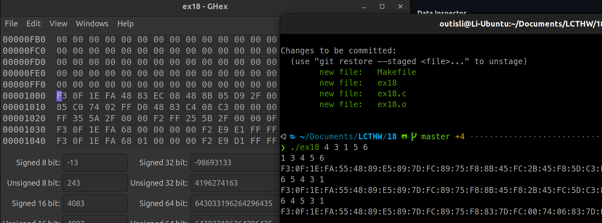
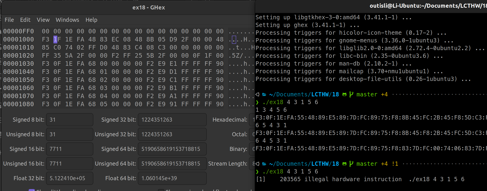
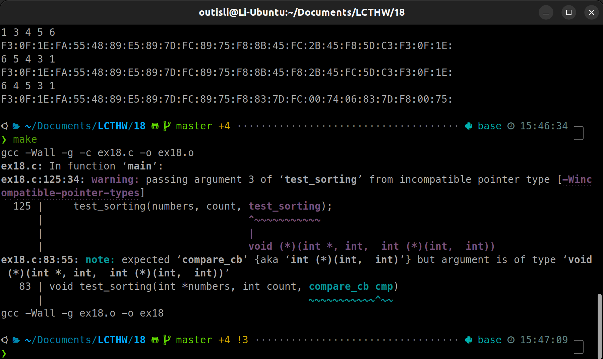
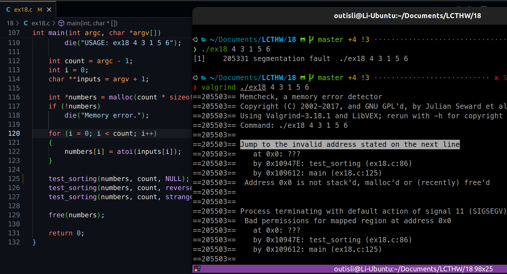
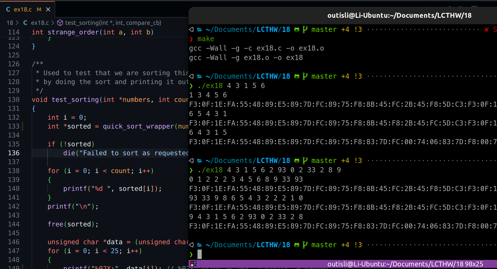

# 2024.04.10-练习18：函数指针

## 1. 函数指针

函数在C中实际上只是指向程序中某一个代码存在位置的指针。就像你创建过的结构体指针、字符串和数组那样，你也可以创建指向函数的指针。函数指针的主要用途是向其他函数传递“回调”，或者模拟类和对象。在这个练习中我们会创建一些回调，并且下一节我们会制作一个简单的对象系统。

函数指针的格式类似这样：

```c
int (*POINTER_NAME)(int a,int b)
```

记住如何编写它的一个方法是：

- 编写一个普通的函数声明：`int callme(int a, int b)`
- 将函数用指针语法包装：`int (*callme)(int a, int b)`
- 将名称改成指针名称：`int (*compare_cb)(int a, int b)`

这个方法的关键是，当你完成这些之后，指针的变量名称为`compare_cb`，而你可以将它用作函数。这类似于指向数组的指针可以表示所指向的数组。指向函数的指针也可以用作表示所指向的函数，只不过是不同的名字。

```c
int (*tester)(int a,int b) = sorted_order;
printf("TEST: %d is same as %d\n", tester(2, 3), sorted_order(2, 3));
```

即使是对于返回指针的函数指针，上述方法依然有效：

- 编写：`char *make_coolness(int awesome_levels)`
- 包装：`char *(*make_coolness)(int awesome_levels)`
- 重命名：`char *(*coolness_cb)(int awesome_levels)`

需要解决的下一个问题是使用函数指针向其它函数提供参数比较困难，比如当你打算向其它函数传递回调函数的时候。解决方法是使用`typedef`，它是C的一个关键字，可以给其它更复杂的类型起个新的名字。你需要记住的事情是，将`typedef`添加到相同的指针语法之前，然后你就可以将那个名字用作类型了。

## 2. program

```c
#include <stdio.h>
#include <stdlib.h>
#include <errno.h>
#include <string.h>

/** Our old friend die from ex17. */
void die(const char *message)
{
    if(errno) {
        perror(message);
    } else {
        printf("ERROR: %s\n", message);
    }

    exit(1);
}

// a typedef creates a fake type, in this
// case for a function pointer
typedef int (*compare_cb)(int a, int b);

/**
 * A classic bubble sort function that uses the
 * compare_cb to do the sorting.
 */
int *bubble_sort(int *numbers, int count, compare_cb cmp)
{
    int temp = 0;
    int i = 0;
    int j = 0;
    int *target = malloc(count * sizeof(int));

    if(!target) die("Memory error.");

    memcpy(target, numbers, count * sizeof(int));

    for(i = 0; i < count; i++) {
        for(j = 0; j < count - 1; j++) {
            if(cmp(target[j], target[j+1]) > 0) {
                temp = target[j+1];
                target[j+1] = target[j];
                target[j] = temp;
            }
        }
    }

    return target;
}

int sorted_order(int a, int b)
{
    return a - b;
}

int reverse_order(int a, int b)
{
    return b - a;
}

int strange_order(int a, int b)
{
    if(a == 0 || b == 0) {
        return 0;
    } else {
        return a % b;
    }
}

/**
 * Used to test that we are sorting things correctly
 * by doing the sort and printing it out.
 */
void test_sorting(int *numbers, int count, compare_cb cmp)
{
    int i = 0;
    int *sorted = bubble_sort(numbers, count, cmp);

    if(!sorted) die("Failed to sort as requested.");

    for(i = 0; i < count; i++) {
        printf("%d ", sorted[i]);
    }
    printf("\n");

    free(sorted);
}

int main(int argc, char *argv[])
{
    if(argc < 2) die("USAGE: ex18 4 3 1 5 6");

    int count = argc - 1;
    int i = 0;
    char **inputs = argv + 1;

    int *numbers = malloc(count * sizeof(int));
    if(!numbers) die("Memory error.");

    for(i = 0; i < count; i++) {
        numbers[i] = atoi(inputs[i]);
    }

    test_sorting(numbers, count, sorted_order);
    test_sorting(numbers, count, reverse_order);
    test_sorting(numbers, count, strange_order);

    free(numbers);

    return 0;
}
```

## 3. 函数指针汇编字节码

```c
typedef int (*compare_cb)(int a, int b);
compare_cb cmp;
unsigned char *data = (unsigned char *)cmp;

for(i = 0; i < 25; i++) {
    printf("%02x:", data[i]);
}

// output:
55:48:89:e5:89:7d:fc:89:75:f8:8b:55:fc:8b:45:f8:29:d0:c9:c3:55:48:89:e5:89:
```

这段代码试图以十六进制的形式打印出一个函数指针（`cmp`）所指向的函数的前25个字节。`compare_cb`是一个函数指针的类型定义，指向一个接受两个`int`类型参数并返回`int`类型结果的函数。`unsigned char *data = (unsigned char *)cmp;`这行代码将函数指针`cmp`转换为一个`unsigned char`类型的指针，这样就可以逐字节地访问函数指针所指向的函数的机器代码。

在循环中，程序逐个字节地访问并打印出这个函数的机器代码，直到打印了25个字节。每个字节以两位十六进制数的形式打印，后面跟着一个冒号。

输出的具体内容取决于`cmp`所指向的函数的机器代码，这又依赖于具体的函数实现、编译器以及目标平台的架构。不同的编译器优化设置可能产生不同的机器代码。此外，不同的处理器架构（如x86、ARM等）有其独特的指令集，导致即使是相同的高级语言函数，其编译成的机器代码也会不同。

由于这段代码直接访问和解释函数的机器码，它涉及到底层的、平台特定的行为。在大多数现代操作系统和处理器架构中，试图访问函数的机器码是不推荐的，因为：

1. **可移植性差**：这段代码的行为在不同的系统和编译器下可能会有很大差异。
2. **安全性**：现代操作系统通常实施某种形式的代码和数据分离（如DEP/NX），这可能阻止程序以这种方式访问函数的代码。
3. **实用性**：除了特定的底层编程或逆向工程场景外，直接处理函数的机器码通常是不必要的。

总之，这段代码的目的是展示如何以字节为单位访问和打印出一个函数的机器码，但实际应用场景有限，且在不同环境中的行为可能会有很大差异。

## 4. 附加题

### 4.1 十六进制编辑器

用十六进制编辑器打开`ex18`，接着找到函数起始处的十六进制代码序列，看看是否能在原始程序中找到函数。



### 4.2 修改十六进制文件



修改了上述函数的汇编机器码，结果就提示不合法的硬件指令

### 4.3 传递错误函数



### 4.4 传递NULL到原函数指针位置



### 4.5 快速排序

```c
void swap(int *a, int *b) {
    int temp = *a;
    *a = *b;
    *b = temp;
}

int partition(int *array, int low, int high, compare_cb cmp) {
    int pivot = array[high];
    int i = (low - 1);

    for (int j = low; j <= high - 1; j++) {
        if (cmp(array[j], pivot) < 0) {
            i++;
            swap(&array[i], &array[j]);
        }
    }
    swap(&array[i + 1], &array[high]);
    return (i + 1);
}

void quick_sort(int *array, int low, int high, compare_cb cmp) {
    if (low < high) {
        int pi = partition(array, low, high, cmp);

        quick_sort(array, low, pi - 1, cmp);
        quick_sort(array, pi + 1, high, cmp);
    }
}

int *quick_sort_wrapper(int *numbers, int count, compare_cb cmp) {
    int *target = malloc(count * sizeof(int));
    if (!target) die("Memory error.");

    memcpy(target, numbers, count * sizeof(int));
    quick_sort(target, 0, count - 1, cmp);

    return target;
}
```

