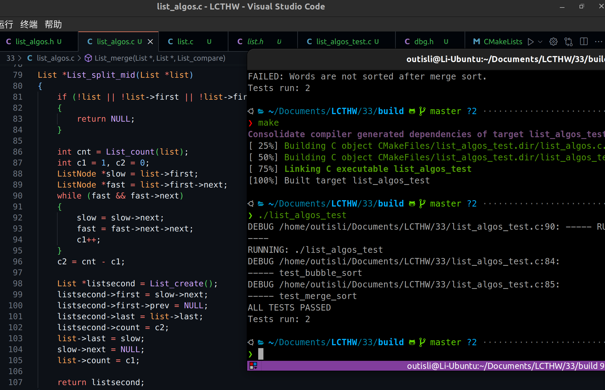
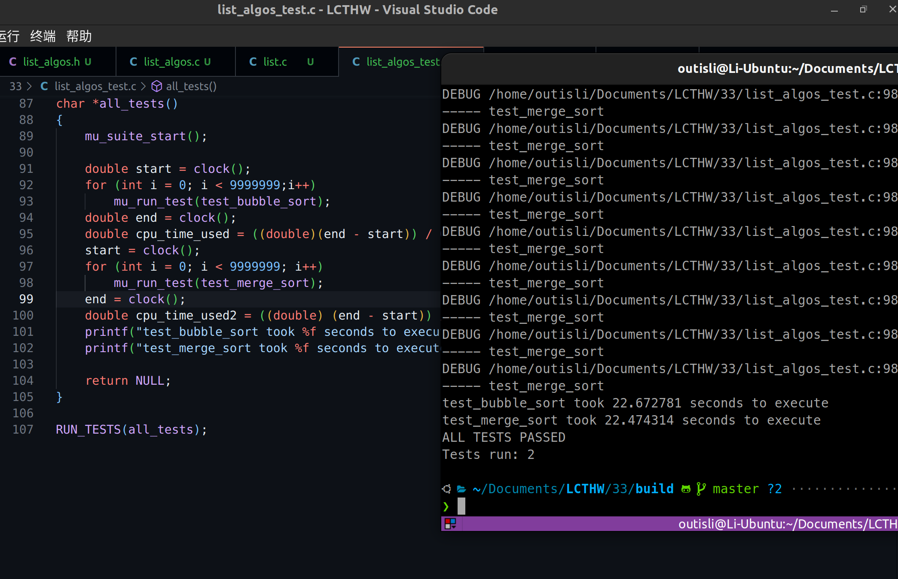
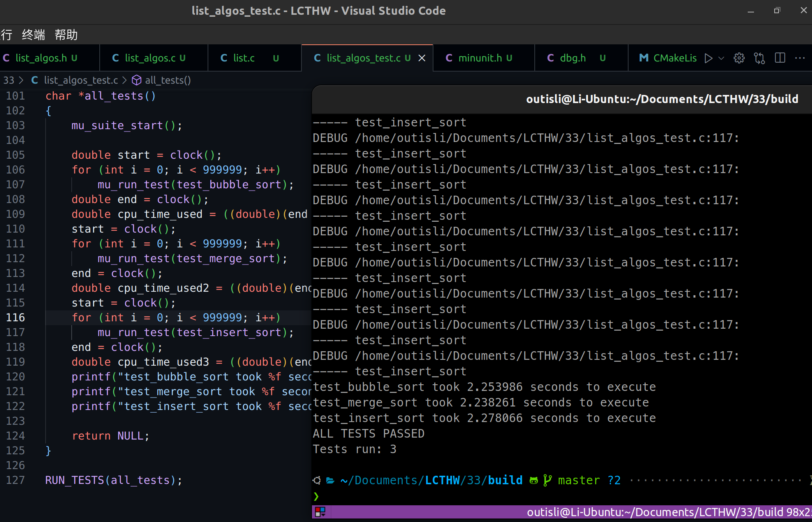

# 2024.04.11-练习33：链表算法

## 1. 归并排序

归并排序是一种高效、稳定的排序算法，使用分治法（Divide and Conquer）的一个非常典型的应用。它的基本思想是将两个或两个以上的有序表合并成一个新的有序表，即把待排序序列分为若干个子序列，每个子序列是有序的。然后再把有序子序列合并为整体有序序列。

归并排序的过程可以分为两个主要部分：

1. **拆分**：从中间将待排序数组拆分成两个子数组，递归地对这两个子数组进行归并排序，直到子数组长度为1或0。
2. **合并**：将两个有序的子数组合并成一个有序数组。合并过程需要额外的空间来暂存数据。

归并排序的时间复杂度为$O(n \log n)$，不管最坏情况还是平均情况都是这个时间复杂度，其中 $n$ 是数组或列表的长度。这是因为归并排序总是把列表分成两半，然后进行合并，所以拆分的层数（递归深度）是 $n \log n$ ，每层需要的比较和合并操作是 $n$ 次，所以总的操作次数是 $n\log n$。

归并排序的稳定性来源于合并过程中，相等的元素会保持原有的先后顺序。这使得归并排序非常适合用于需要稳定排序算法的场景，比如数据库的排序等。

这个算法的空间复杂度是 $O(n)$，因为合并过程需要与原始数组相等大小的空间来暂时存储合并后的数组。

归并排序虽然在时间复杂度上表现良好，但由于其空间复杂度较高，因此在对空间使用有严格要求的环境下需要慎用。

## 2. 代码

### 2.1 头文件

```c
#ifndef lcthw_List_algos_h
#define lcthw_List_algos_h

#include <lcthw/list.h>

typedef int (*List_compare)(const void *a, const void *b);

int List_bubble_sort(List *list, List_compare cmp);

List *List_merge_sort(List *list, List_compare cmp);

static inline void ListNode_swap(ListNode *a, ListNode *b)
{
    void *temp = a->value;
    a->value = b->value;
    b->value = temp;
}

List *List_merge(List *left, List *right, List_compare cmp);

#endif
```

### 2.2 实现

```c
#include <lcthw/list_algos.h>
#include <lcthw/dbg.h>

int List_bubble_sort(List *list, List_compare cmp)
{
    int sorted = 1;

    if(List_count(list) <= 1) {
        return 0;  // already sorted
    }

    do {
        sorted = 1;
        LIST_FOREACH(list, first, next, cur) {
            if(cur->next) {
                if(cmp(cur->value, cur->next->value) > 0) {
                    ListNode_swap(cur, cur->next);
                    sorted = 0;
                }
            }
        }
    } while(!sorted);

    return 0;
}

List *List_merge(List *left, List *right, List_compare cmp)
{
    List *result = List_create();
    void *val = NULL;

    while(List_count(left) > 0 || List_count(right) > 0) {
        if(List_count(left) > 0 && List_count(right) > 0) {
            if(cmp(List_first(left), List_first(right)) <= 0) {
                val = List_shift(left);
            } else {
                val = List_shift(right);
            }

            List_push(result, val);
        } else if(List_count(left) > 0) {
            val = List_shift(left);
            List_push(result, val);
        } else if(List_count(right) > 0) {
            val = List_shift(right);
            List_push(result, val);
        }
    }

    return result;
}

List *List_merge_sort(List *list, List_compare cmp)
{
    if(List_count(list) <= 1) {
        return list;
    }

    List *left = List_create();
    List *right = List_create();
    int middle = List_count(list) / 2;

    LIST_FOREACH(list, first, next, cur) {
        if(middle > 0) {
            List_push(left, cur->value);
        } else {
            List_push(right, cur->value);
        }

        middle--;
    }

    List *sort_left = List_merge_sort(left, cmp);
    List *sort_right = List_merge_sort(right, cmp);

    if(sort_left != left) List_destroy(left);
    if(sort_right != right) List_destroy(right);

    return List_merge(sort_left, sort_right, cmp);
}
```

### 2.3 单元测试

```c
#include "minunit.h"
#include <lcthw/list_algos.h>
#include <assert.h>
#include <string.h>

char *values[] = {"XXXX", "1234", "abcd", "xjvef", "NDSS"};
#define NUM_VALUES 5

List *create_words()
{
    int i = 0;
    List *words = List_create();

    for(i = 0; i < NUM_VALUES; i++) {
        List_push(words, values[i]);
    }

    return words;
}

int is_sorted(List *words)
{
    LIST_FOREACH(words, first, next, cur) {
        if(cur->next && strcmp(cur->value, cur->next->value) > 0) {
            debug("%s %s", (char *)cur->value, (char *)cur->next->value);
            return 0;
        }
    }

    return 1;
}

char *test_bubble_sort()
{
    List *words = create_words();

    // should work on a list that needs sorting
    int rc = List_bubble_sort(words, (List_compare)strcmp);
    mu_assert(rc == 0, "Bubble sort failed.");
    mu_assert(is_sorted(words), "Words are not sorted after bubble sort.");

    // should work on an already sorted list
    rc = List_bubble_sort(words, (List_compare)strcmp);
    mu_assert(rc == 0, "Bubble sort of already sorted failed.");
    mu_assert(is_sorted(words), "Words should be sort if already bubble sorted.");

    List_destroy(words);

    // should work on an empty list
    words = List_create(words);
    rc = List_bubble_sort(words, (List_compare)strcmp);
    mu_assert(rc == 0, "Bubble sort failed on empty list.");
    mu_assert(is_sorted(words), "Words should be sorted if empty.");

    List_destroy(words);

    return NULL;
}

char *test_merge_sort()
{
    List *words = create_words();

    // should work on a list that needs sorting
    List *res = List_merge_sort(words, (List_compare)strcmp);
    mu_assert(is_sorted(res), "Words are not sorted after merge sort.");

    List *res2 = List_merge_sort(res, (List_compare)strcmp);
    mu_assert(is_sorted(res), "Should still be sorted after merge sort.");
    List_destroy(res2);
    List_destroy(res);

    List_destroy(words);
    return NULL;
}

char *all_tests()
{
    mu_suite_start();

    mu_run_test(test_bubble_sort);
    mu_run_test(test_merge_sort);

    return NULL;
}

RUN_TESTS(all_tests);
```

### 2.4 inline

### 标准`inline`函数的使用

当你在头文件中使用`inline`关键字声明和定义一个函数时，你告诉编译器这个函数的调用可以被替换为其函数体，即内联展开。这可以减少函数调用的开销，特别是对于那些非常小且频繁调用的函数。

### 使用`static inline`

通过在头文件中将函数定义为`static inline`，你可以避免链接问题。这样做的结果是，每个包含此头文件的`.c`文件都会得到函数的一个私有副本。这种方法很简单，适用于大多数情况，特别是当函数非常短小时。

```c
#ifndef EXAMPLE_H
#define EXAMPLE_H

// Inline function declaration
static inline void myFunction(int x) {
    // Function implementation
}

#endif // EXAMPLE_H
```

这种方式不需要在源文件中额外定义函数。

如果你的目的是确保有一个非内联的版本可用，你可能不需要在源文件中使用**`inline`**或**`extern`**关键字，因为**`static inline`**的使用通常已经足够。我之前的建议在这方面可能不完全准确，因为在C中使用**`inline`**函数的最佳实践可能因编译器和具体情况而异。如果确实需要在某个地方提供一个明确的外部定义，那么你应该在源文件中提供一个普通的函数定义（无**`inline`**关键字），但这在使用了**`static inline`**定义的情况下通常是不必要的。

## 3. 改进

归并排序做了大量的链表复制和创建操作，寻找减少它们的办法。

```c
List *List_merge(List *left, List *right, List_compare cmp)
{
    List *result = List_create();

    while (left->first && right->first)
    {
        if (cmp(left->first->value, right->first->value) <= 0)
        {
            List_push(result, List_shift(left));
        }
        else
        {
            List_push(result, List_shift(right));
        }
    }
    while (left->first)
    {
        List_push(result, List_shift(left));
    }
    while (right->first)
    {
        List_push(result, List_shift(right));
    }

    return result;
}

List *List_merge_sort(List *list, List_compare cmp)
{
    if (List_count(list) <= 1)
    {
        return list;
    }

    List *secondHalf = List_split_mid(list);

    List *sort_left = List_merge_sort(list, cmp);
    List *sort_right = List_merge_sort(secondHalf, cmp);

    if (sort_left != list)
        List_destroy(list);
    if (sort_right != secondHalf)
        List_destroy(secondHalf);

    return List_merge(sort_left, sort_right, cmp);
}

List *List_split_mid(List *list)
{
    if (!list || !list->first || !list->first->next)
    {
        return NULL;
    }

    int cnt = List_count(list);
    int c1 = 1, c2 = 0;
    ListNode *slow = list->first;
    ListNode *fast = list->first->next;
    while (fast && fast->next)
    {
        slow = slow->next;
        fast = fast->next->next;
        c1++;
    }
    c2 = cnt - c1;

    List *listsecond = List_create();
    listsecond->first = slow->next;
    listsecond->first->prev = NULL;
    listsecond->last = list->last;
    listsecond->count = c2;
    list->last = slow;
    slow->next = NULL;
    list->count = c1;

    return listsecond;
}
```



## 4. 附加题

### 4.1 程序运行时间

```c
double start = clock();
mu_run_test(test_bubble_sort);
double end = clock();
double cpu_time_used = ((double)(end - start)) / CLOCKS_PER_SEC;
printf("test_bubble_sort took %f seconds to execute \n", cpu_time_used);
start = clock();
mu_run_test(test_merge_sort);
end = clock();
cpu_time_used = ((double) (end - start)) / CLOCKS_PER_SEC;
printf("test_merge_sort took %f seconds to execute \n", cpu_time_used);
```



### 4.2 `List_insert_sorted`

实现`List_insert_sorted`（有序链表），它使用`List_compare`，接收一个值，将其插入到正确的位置，使链表有序。

```c
void List_insert_sorted(List *list, void *value, List_compare cmp){
    ListNode *node = malloc(sizeof(ListNode));
    node->value = value;
    node->next = NULL;

    if(list->first == NULL || cmp(value, list->first->value) < 0) {
        // 插入到链表头部
        node->next = list->first;
        list->first = node;
        if(list->last == NULL) {
            list->last = node;
        }
    } else {
        // 在链表中找到正确的插入位置
        ListNode *current = list->first;
        while(current->next != NULL && cmp(value, current->next->value) > 0) {
            current = current->next;
        }
        // 插入到current节点之后
        node->next = current->next;
        current->next = node;
        if(current->next == NULL) {
            list->last = node;
        }
    }
    list->count++;
}
```

