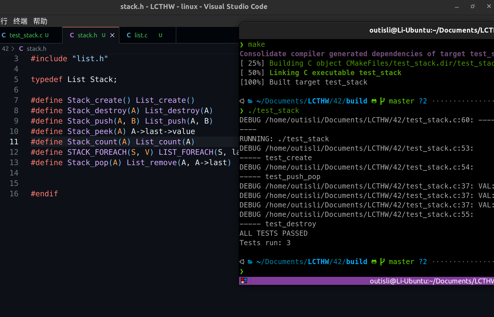
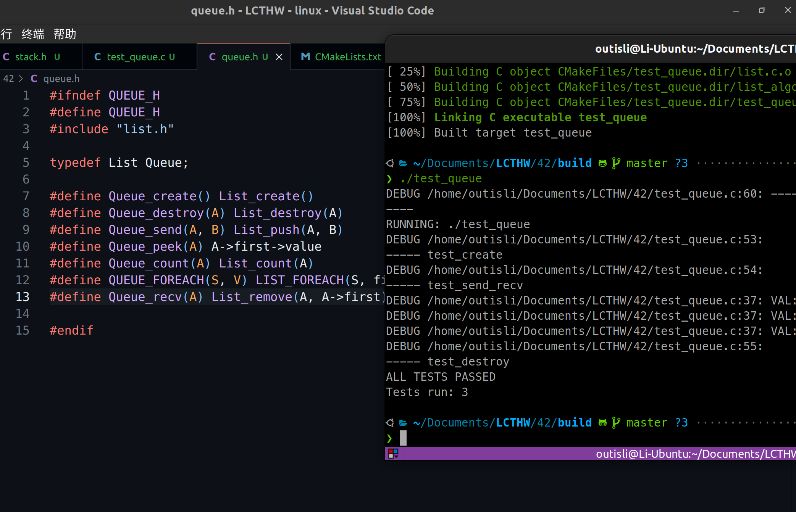

# 2024.04.11-练习42：栈和队列

## 1. 栈

### 1.1 头文件

```c
#ifndef STACK_H
#define STACK_H
#include "list.h"

typedef List Stack;

#define Stack_create() List_create()
#define Stack_destroy(A) List_destroy(A)
#define Stack_push(A, B) List_push(A, B)
#define Stack_peek(A) A->last->value
#define Stack_count(A) List_count(A)
#define STACK_FOREACH(S, V) LIST_FOREACH(S, last, prev, V)
#define Stack_pop(A) List_remove(A, A->last)

#endif
```

### 1.2 单元测试

```c
#include "minunit.h"
#include <lcthw/stack.h>
#include <assert.h>

static Stack *stack = NULL;
char *tests[] = {"test1 data", "test2 data", "test3 data"};
#define NUM_TESTS 3

char *test_create()
{
    stack = Stack_create();
    mu_assert(stack != NULL, "Failed to create stack.");

    return NULL;
}

char *test_destroy()
{
    mu_assert(stack != NULL, "Failed to make stack #2");
    Stack_destroy(stack);

    return NULL;
}

char *test_push_pop()
{
    int i = 0;
    for(i = 0; i < NUM_TESTS; i++) {
        Stack_push(stack, tests[i]);
        mu_assert(Stack_peek(stack) == tests[i], "Wrong next value.");
    }

    mu_assert(Stack_count(stack) == NUM_TESTS, "Wrong count on push.");

    STACK_FOREACH(stack, cur) {
        debug("VAL: %s", (char *)cur->value);
    }

    for(i = NUM_TESTS - 1; i >= 0; i--) {
        char *val = Stack_pop(stack);
        mu_assert(val == tests[i], "Wrong value on pop.");
    }

    mu_assert(Stack_count(stack) == 0, "Wrong count after pop.");

    return NULL;
}

char *all_tests() {
    mu_suite_start();

    mu_run_test(test_create);
    mu_run_test(test_push_pop);
    mu_run_test(test_destroy);

    return NULL;
}

RUN_TESTS(all_tests);
```



## 2. 队列

### 2.1 头文件

```c
#ifndef QUEUE_H
#define QUEUE_H
#include "list.h"

typedef List Queue;

#define Queue_create() List_create()
#define Queue_destroy(A) List_destroy(A)
#define Queue_send(A, B) List_push(A, B)
#define Queue_peek(A) A->first->value
#define Queue_count(A) List_count(A)
#define QUEUE_FOREACH(S, V) LIST_FOREACH(S, first, next, V)
#define Queue_recv(A) List_remove(A, A->first)

#endif
```

### 2.2 单元测试

