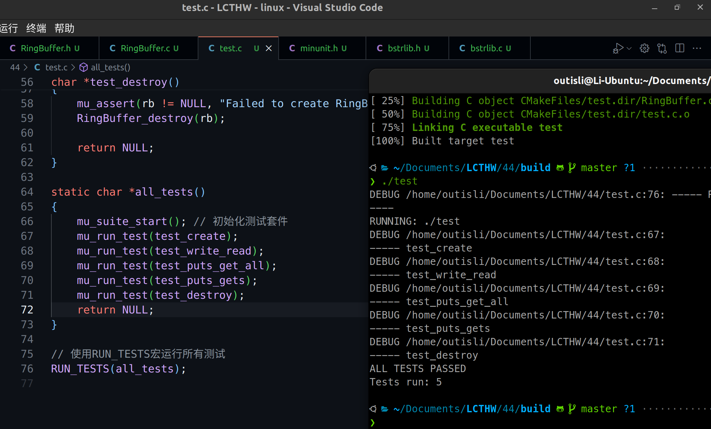

# 2024.04.12-练习44：环形缓冲区

## 1. 头文件

```c
#ifndef _lcthw_RingBuffer_h
#define _lcthw_RingBuffer_h

#include <lcthw/bstrlib.h>

typedef struct {
    char *buffer;
    int length;
    int start;
    int end;
} RingBuffer;

RingBuffer *RingBuffer_create(int length);

void RingBuffer_destroy(RingBuffer *buffer);

int RingBuffer_read(RingBuffer *buffer, char *target, int amount);

int RingBuffer_write(RingBuffer *buffer, char *data, int length);

int RingBuffer_empty(RingBuffer *buffer);

int RingBuffer_full(RingBuffer *buffer);

int RingBuffer_available_data(RingBuffer *buffer);

int RingBuffer_available_space(RingBuffer *buffer);

bstring RingBuffer_gets(RingBuffer *buffer, int amount);

#define RingBuffer_available_data(B) (((B)->end + 1) % (B)->length - (B)->start - 1)

#define RingBuffer_available_space(B) ((B)->length - (B)->end - 1)

#define RingBuffer_full(B) (RingBuffer_available_data((B)) - (B)->length == 0)

#define RingBuffer_empty(B) (RingBuffer_available_data((B)) == 0)

#define RingBuffer_puts(B, D) RingBuffer_write((B), bdata((D)), blength((D)))

#define RingBuffer_get_all(B) RingBuffer_gets((B), RingBuffer_available_data((B)))

#define RingBuffer_starts_at(B) ((B)->buffer + (B)->start)

#define RingBuffer_ends_at(B) ((B)->buffer + (B)->end)

#define RingBuffer_commit_read(B, A) ((B)->start = ((B)->start + (A)) % (B)->length)

#define RingBuffer_commit_write(B, A) ((B)->end = ((B)->end + (A)) % (B)->length)

#endif
```

这段代码定义了一个环形缓冲区（Ring Buffer），它是一种数据结构，用于在有限的缓冲区空间中高效地处理数据流。这种结构非常适合于需要循环利用空间的场景，比如网络通信或文件流处理。以下是代码中各部分的详细解释：

### 头文件和宏定义

```c
#ifndef _lcthw_RingBuffer_h
#define _lcthw_RingBuffer_h
#include <lcthw/bstrlib.h>
```

这部分代码使用预处理命令来防止头文件被重复包含。`#include <lcthw/bstrlib.h>`是引入一个字符串库，这个库可能提供了一些额外的字符串处理功能。

### 结构体定义

```c
typedef struct {
    char *buffer;
    int length;
    int start;
    int end;
} RingBuffer;
```

这是环形缓冲区的基础结构，包含了以下字段：

- `char *buffer`：指向实际存储数据的内存区域。
- `int length`：缓冲区的总长度。
- `int start`：指示数据开始的位置。
- `int end`：指示数据结束的位置。

### 函数原型

环形缓冲区的操作包括创建、销毁、读取、写入以及检查缓冲区的状态：

- `RingBuffer_create(int length)`：创建一个指定长度的环形缓冲区。
- `RingBuffer_destroy(RingBuffer *buffer)`：销毁缓冲区，释放资源。
- `RingBuffer_read(RingBuffer *buffer, char *target, int amount)`：从缓冲区读取数据到`target`数组。
- `RingBuffer_write(RingBuffer *buffer, char *data, int length)`：将数据写入缓冲区。
- `bstring RingBuffer_gets(RingBuffer *buffer, int amount)`：读取指定数量的数据为一个`bstring`。

### 宏定义

这些宏定义提供了一种快速访问缓冲区状态的方式，比如检查缓冲区是否空或满：

- `RingBuffer_available_data(B)`：计算缓冲区中已存储的数据量。
- `RingBuffer_available_space(B)`：计算缓冲区中剩余的空间量。
- `RingBuffer_full(B)`：检查缓冲区是否已满。
- `RingBuffer_empty(B)`：检查缓冲区是否为空。
- `RingBuffer_puts(B, D)`：便捷函数，用于将`bstring`类型的数据写入缓冲区。
- `RingBuffer_get_all(B)`：获取缓冲区中的所有数据。

### 提交数据的宏

- `RingBuffer_commit_read(B, A)`：在读取操作后更新`start`位置。
- `RingBuffer_commit_write(B, A)`：在写入操作后更新`end`位置。

## 2. 源文件

```c
#undef NDEBUG
#include <assert.h>
#include <stdio.h>
#include <stdlib.h>
#include <string.h>
#include <lcthw/dbg.h>
#include <lcthw/ringbuffer.h>

RingBuffer *RingBuffer_create(int length)
{
    RingBuffer *buffer = calloc(1, sizeof(RingBuffer));
    buffer->length  = length + 1;
    buffer->start = 0;
    buffer->end = 0;
    buffer->buffer = calloc(buffer->length, 1);

    return buffer;
}

void RingBuffer_destroy(RingBuffer *buffer)
{
    if(buffer) {
        free(buffer->buffer);
        free(buffer);
    }
}

int RingBuffer_write(RingBuffer *buffer, char *data, int length)
{
    if(RingBuffer_available_data(buffer) == 0) {
        buffer->start = buffer->end = 0;
    }

    check(length <= RingBuffer_available_space(buffer),
            "Not enough space: %d request, %d available",
            RingBuffer_available_data(buffer), length);

    void *result = memcpy(RingBuffer_ends_at(buffer), data, length);
    check(result != NULL, "Failed to write data into buffer.");

    RingBuffer_commit_write(buffer, length);

    return length;
error:
    return -1;
}

int RingBuffer_read(RingBuffer *buffer, char *target, int amount)
{
    check_debug(amount <= RingBuffer_available_data(buffer),
            "Not enough in the buffer: has %d, needs %d",
            RingBuffer_available_data(buffer), amount);

    void *result = memcpy(target, RingBuffer_starts_at(buffer), amount);
    check(result != NULL, "Failed to write buffer into data.");

    RingBuffer_commit_read(buffer, amount);

    if(buffer->end == buffer->start) {
        buffer->start = buffer->end = 0;
    }

    return amount;
error:
    return -1;
}

bstring RingBuffer_gets(RingBuffer *buffer, int amount)
{
    check(amount > 0, "Need more than 0 for gets, you gave: %d ", amount);
    check_debug(amount <= RingBuffer_available_data(buffer),
            "Not enough in the buffer.");

    bstring result = blk2bstr(RingBuffer_starts_at(buffer), amount);
    check(result != NULL, "Failed to create gets result.");
    check(blength(result) == amount, "Wrong result length.");

    RingBuffer_commit_read(buffer, amount);
    assert(RingBuffer_available_data(buffer) >= 0 && "Error in read commit.");

    return result;
error:
    return NULL;
}
```

这个 `RingBuffer_write` 函数是一个环形缓冲区的写操作函数，其作用是将数据从一个指定的源（`data` 参数）写入到环形缓冲区中。这段代码涉及错误检查、内存复制以及更新缓冲区指针的操作。下面我将逐步解析这个函数的每一部分。

### `RingBuffer_write`函数签名

```c
int RingBuffer_write(RingBuffer *buffer, char *data, int length)
```

这个函数接收三个参数：

- `buffer`：指向 `RingBuffer` 类型的指针，代表目标环形缓冲区。
- `data`：指向需要写入缓冲区的数据的指针。
- `length`：指定要写入的数据长度。

函数返回写入的字节数，如果出现错误，则返回 `-1`。

### 函数体

### 确定起始位置

```c
if(RingBuffer_available_data(buffer) == 0) {
    buffer->start = buffer->end = 0;
}
```

这里检查缓冲区是否为空（没有数据）。如果是空的，将 `start` 和 `end` 指针都重置为 `0`。这种重置是为了优化写入性能，确保从缓冲区的开始位置写入数据。

### 检查是否有足够空间

```c
check(length <= RingBuffer_available_space(buffer),
      "Not enough space: %d request, %d available",
      RingBuffer_available_data(buffer), length);
```

使用 `check` 宏（这通常是一个错误处理宏）来确保要写入的数据长度不会超过缓冲区的可用空间。如果超出可用空间，则打印错误信息并跳转到错误处理代码（`error:` 标签）。

### 数据复制

```c
void *result = memcpy(RingBuffer_ends_at(buffer), data, length);
check(result != NULL, "Failed to write data into buffer.");
```

通过 `memcpy` 函数将数据从 `data` 指针复制到缓冲区中由 `RingBuffer_ends_at(buffer)` 返回的位置。`memcpy` 应该总是返回其目的地址，除非发生异常。这里的检查是为了确保数据确实被写入了。

### 提交写操作

```c
RingBuffer_commit_write(buffer, length);
```

更新缓冲区的 `end` 指针，以反映新写入的数据量。这通过 `RingBuffer_commit_write` 宏实现，它会适当地调整 `end` 指针，包括处理可能的环形回绕。

### 成功返回

```c
return length;
```

如果一切正常，函数返回写入的字节数。

### 错误处理

```c
error:
    return -1;
```

如果在检查或写操作中遇到任何问题，函数跳转到这里并返回 `-1`，表示发生了错误。

### `RingBuffer_write`总结

`RingBuffer_write` 是一个典型的环形缓冲区数据写入函数，它涵盖了错误处理、空间检查、数据复制和指针更新等关键操作。这种实现保证了数据的安全写入，并且能有效地利用缓冲区的空间。通过适当的指针和边界管理，环形缓冲区可以在有限的内存空间内循环使用，非常适用于如 I/O 数据流处理等场景。

`RingBuffer_read` 和 `RingBuffer_gets` 都是环形缓冲区中用于从缓冲区读取数据的函数，但它们在处理数据的方式和返回类型上有所不同。这两个函数各有其特定的用途和行为，下面详细解释这两者之间的区别：

### `RingBuffer_read`

- **功能**：将数据从环形缓冲区复制到另一个缓冲区（通常是一个字符数组）。
- **参数**：
    - `buffer`：指向 `RingBuffer` 结构的指针。
    - `target`：目标缓冲区，用于接收从环形缓冲区复制的数据。
    - `amount`：要从环形缓冲区读取的数据字节数。
- **行为**：
    - 使用 `memcpy` 从 `RingBuffer_starts_at(buffer)` 的位置开始，将 `amount` 字节的数据复制到 `target` 中。
    - 读取操作完成后，通过 `RingBuffer_commit_read` 更新 `start` 指针。
    - 如果 `start` 和 `end` 指针相等，表示缓冲区变为空，将它们重置为0。
- **返回值**：成功时返回读取的字节数，失败时返回 `1`。

### `RingBuffer_gets`

- **功能**：从环形缓冲区获取一定数量的数据，并返回一个 `bstring` 对象。
- **参数**：
    - `buffer`：指向 `RingBuffer` 结构的指针。
    - `amount`：要从环形缓冲区读取的数据字节数。
- **行为**：
    - 使用 `blk2bstr` 从环形缓冲区的 `start` 位置创建一个新的 `bstring` 对象，其中包含 `amount` 字节的数据。
    - 类似于 `RingBuffer_read`，读取操作后通过 `RingBuffer_commit_read` 更新 `start` 指针。
    - 检查返回的 `bstring` 的长度是否正确，并确保没有数据处理错误。
- **返回值**：成功时返回一个 `bstring` 对象，失败时返回 `NULL`。

### 主要区别

1. **返回类型**：
    - `RingBuffer_read` 返回一个整数（读取的字节数），并将数据直接写入提供的目标缓冲区。
    - `RingBuffer_gets` 返回一个 `bstring` 对象，这是一个封装了数据和长度的结构体，用于更方便的字符串处理。
2. **数据处理方式**：
    - `RingBuffer_read` 直接操作原始字节数据。
    - `RingBuffer_gets` 则可能更适用于处理文本数据，因为它提供了一种易于管理和操作的字符串形式。
3. **错误处理和安全性**：
    - `RingBuffer_gets` 在创建 `bstring` 时进行了额外的检查，如长度验证和空值检查，这可以提供更高的数据完整性保证。
4. **使用场景**：
    - `RingBuffer_read` 更多地用于需要直接处理字节数据的场景，如文件读写、网络数据传输等。
    - `RingBuffer_gets` 适用于需要字符串操作的场景，比如解析文本命令或读取配置文件等。

总之，选择 `RingBuffer_read` 还是 `RingBuffer_gets` 取决于你的应用场景和对数据类型的需求。如果你需要直接处理原始数据，`RingBuffer_read` 是合适的；如果你需要处理和存储字符串数据，并可能在之后进行进一步的字符串操作，`RingBuffer_gets` 会是更好的选择。

## 3. 测试

```c
#include "minunit.h"    // 引入MinUnit头文件
#include "RingBuffer.h" // 引入环形缓冲区的实现
#include <assert.h>

#define NUM_TESTS 5
static RingBuffer *rb = NULL;

char *test_create()
{
    rb = RingBuffer_create(1024);
    mu_assert(rb != NULL, "Failed to create RingBuffer");
    mu_assert(rb->length == 1025, "RingBuffer length incorrect");
    mu_assert(RingBuffer_empty(rb), "RingBuffer should be empty after creation");

    return NULL;
}

char *test_write_read()
{
    char *data = "test";
    int result = RingBuffer_write(rb, data, 4);
    mu_assert(result == 4, "RingBuffer_write should write 4 bytes");

    char output[5] = {0}; // 确保有足够的空间和零初始化
    result = RingBuffer_read(rb, output, 4);
    mu_assert(result == 4, "RingBuffer_read should read 4 bytes");
    mu_assert(strcmp(output, "test") == 0, "RingBuffer_read did not read the correct data");

    return NULL;
}

char *test_puts_get_all()
{
    bstring data = bfromcstr("test");
    RingBuffer_puts(rb, data);
    bstring result = RingBuffer_get_all(rb);
    mu_assert(biseq(data, result), "RingBuffer_get_all did not return the correct data");
    bdestroy(data);
    bdestroy(result);

    return NULL;
}

char *test_puts_gets()
{
    bstring data = bfromcstr("test");
    RingBuffer_puts(rb, data);
    bstring result = RingBuffer_gets(rb, 4);
    mu_assert(biseq(data, result), "RingBuffer_gets did not return the correct data");
    bdestroy(data);
    bdestroy(result);

    return NULL;
}

char *test_destroy()
{
    mu_assert(rb != NULL, "Failed to create RingBuffer#2");
    RingBuffer_destroy(rb);

    return NULL;
}

static char *all_tests()
{
    mu_suite_start(); // 初始化测试套件
    mu_run_test(test_create);
    mu_run_test(test_write_read);
    mu_run_test(test_puts_get_all);
    mu_run_test(test_puts_gets);
    mu_run_test(test_destroy);
    return NULL;
}

// 使用RUN_TESTS宏运行所有测试
RUN_TESTS(all_tests);
```



## 4. 一些修改

```c
//#define RingBuffer_available_data(B) (((B)->end + 1) % (B)->length - (B)->start - 1)
#define RingBuffer_available_data(B) (((B)->end >= (B)->start) ? ((B)->end - (B)->start) : ((B)->length - (B)->start + (B)->end))

//#define RingBuffer_available_space(B) ((B)->length - (B)->end - 1)
#define RingBuffer_available_space(B) ((B)->length - RingBuffer_available_data(B) - 1)

//#define RingBuffer_full(B) (RingBuffer_available_data((B)) - (B)->length == 0)
#define RingBuffer_full(B) (RingBuffer_available_space(B) == 0)
```

原来的宏并没有判断end与start的前后位置。