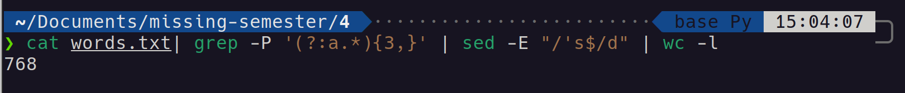
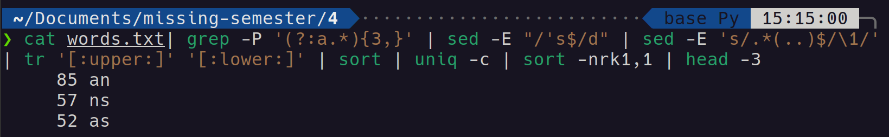
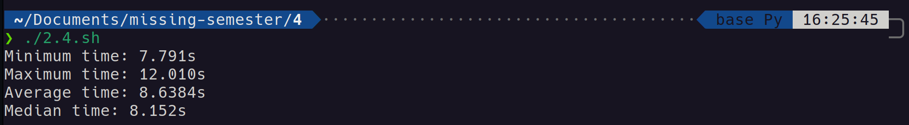

# 2024.03.21-4. Data Wrangling

## 1. journalctl

查看所有日志（默认情况下 ，只保存本次启动的日志）

journalctl

查看内核日志（不显示应用日志）

journalctl -k

查看系统本次启动的日志

journalctl -b

journalctl -b -0

查看上一次启动的日志（需更改设置）

journalctl -b -1

```bash
ssh myserver journalctl | grep sshd
```

这里我们使用管道将一个远程服务器上的文件传递给本机的  `grep`  程序！ `ssh`  太牛了，下一节课我们会讲授命令行环境，届时我们会详细讨论  `ssh`  的相关内容。此时我们打印出的内容，仍然比我们需要的要多得多，读起来也非常费劲。我们来改进一下：

```bash
ssh myserver 'journalctl | grep sshd | grep "Disconnected from"' | less
```

多出来的引号是什么作用呢？这么说吧，我们的日志是一个非常大的文件，把这么大的文件流直接传输到我们本地的电脑上再进行过滤是对流量的一种浪费。因此我们采取另外一种方式，我们先在远端机器上过滤文本内容，然后再将结果传输到本机。 `less`  为我们创建来一个文件分页器，使我们可以通过翻页的方式浏览较长的文本。

为了进一步节省流量，我们甚至可以将当前过滤出的日志保存到文件中，这样后续就不需要再次通过网络访问该文件了：

```bash
ssh myserver 'journalctl | grep sshd | grep "Disconnected from"' > ssh.log
less ssh.log
```

过滤结果中仍然包含不少没用的数据。我们有很多办法可以删除这些无用的数据，但是让我们先研究一下  `sed`  这个非常强大的工具。

`sed`  是一个基于文本编辑器`ed`构建的”流编辑器” 。在  `sed`  中，您基本上是利用一些简短的命令来修改文件，而不是直接操作文件的内容（尽管您也可以选择这样做）。相关的命令行非常多，但是最常用的是  `s`，即*替换*命令，例如我们可以这样写：

```bash
ssh myserver journalctl
 | grep sshd
 | grep "Disconnected from"
 | sed 's/.*Disconnected from //'
```

上面这段命令中，我们使用了一段简单的*正则表达式*。正则表达式是一种非常强大的工具，可以让我们基于某种模式来对字符串进行匹配。`s`  命令的语法如下：`s/REGEX/SUBSTITUTION/`, 其中  `REGEX`  部分是我们需要使用的正则表达式，而  `SUBSTITUTION`  是用于替换匹配结果的文本。

## 2. 正则表达式

正则表达式通常以（尽管并不总是） `/` 开始和结束。大多数的 ASCII 字符都表示它们本来的含义，但是有一些字符确实具有表示匹配行为的“特殊”含义。不同字符所表示的含义，根据正则表达式的实现方式不同，也会有所变化，这一点确实令人沮丧。常见的模式有：

- `.`  除换行符之外的”任意单个字符”
- ``  匹配前面字符零次或多次
- `+`  匹配前面字符一次或多次
- `[abc]`  匹配  `a`, `b`  和  `c`  中的任意一个
- `(RX1|RX2)`  任何能够匹配`RX1`  或  `RX2`的结果
- `^`  行首
- `$`  行尾

正则表达式会如何匹配？`*`  和  `+`  在默认情况下是贪婪模式，也就是说，它们会尽可能多的匹配文本。对于某些正则表达式的实现来说，您可以给  `*`  或  `+`  增加一个`?`  后缀使其变成非贪婪模式

```bash
sed -E 's/.*Disconnected from (invalid |authenticating )?user .* [^ ]+ port [0-9]+( \[preauth\])?$//'
```

IP 地址正则表达式：

```bash
 (?:(?:1[0-9][0-9]\.)|(?:2[0-4][0-9]\.)|(?:25[0-5]\.)|(?:[1-9][0-9]\.)|(?:[0-9]\.)){3}(?:(?:1[0-9][0-9])|(?:2[0-4][0-9])|(?:25[0-5])|(?:[1-9][0-9])|(?:[0-9]))
```

我们实际上希望能够将用户名*保留*下来。对此，我们可以使用“捕获组（capture groups）”来完成。被圆括号内的正则表达式匹配到的文本，都会被存入一系列以编号区分的捕获组中。捕获组的内容可以在替换字符串时使用（有些正则表达式的引擎甚至支持替换表达式本身），例如`\1`、 `\2`、`\3`等等，因此可以使用如下命令：

```bash
sed -E 's/.*Disconnected from (invalid |authenticating )?user (.*) [^ ]+ port [0-9]+( \[preauth\])?$/\2/'
```

### 2.1 正则匹配基本知识及概念

在练习之前，需要大家知道一些基本知识，如果有一定基础的可以跳过该步骤，直接往下看。

### 2.2 正则表达式-字符类

```
[abc]：代表a或者b，或者c字符中的一个。
[^abc]：代表除a,b,c以外的任何字符。
[a-z]：代表a-z的所有小写字符中的一个。
[A-Z]：代表A-Z的所有大写字符中的一个。
[0-9]：代表0-9之间的某一个数字字符。
[a-zA-Z0-9]：代表a-z或者A-Z或者0-9之间的任意一个字符。
[a-dm-p]：a 到 d 或 m 到 p之间的任意一个字符。
```

### 2.3 正则表达式-逻辑运算符

```
&&：并且
| ：或者(可以省略）
```

### 2.4 正则表达式-预定义字符

```
“.” ： 匹配任何字符。
“\d”：任何数字[0-9]的简写；
“\D”：任何非数字[^0-9]的简写；
“\s”： 空白字符：[ \t\n\x0B\f\r] 的简写
“\S”： 非空白字符：[^\s] 的简写
“\w”：单词字符：[a-zA-Z_0-9]的简写
“\W”：非单词字符：[^\w]
```

### 2.5 正则表达式-数量词

```
x? : 0次或1次
x* : 0次到多次
x+ : 1次或多次
X{n} : 恰好n次
X{n,} : 至少n次
X{n,m}: n到m次(n和m都是包含的，最少n次，最多m次。
```

## 3. 数据整理

```bash
ssh myserver journalctl
 | grep sshd
 | grep "Disconnected from"
 | sed -E 's/.*Disconnected from (invalid |authenticating )?user (.*) [^ ]+ port [0-9]+( \[preauth\])?$/\2/'
 | sort | uniq -c
```

`sort`  会对其输入数据进行排序。`uniq -c`  会把连续出现的行折叠为一行并使用出现次数作为前缀。我们希望按照出现次数排序，过滤出最常出现的用户名：

```bash
ssh myserver journalctl
 | grep sshd
 | grep "Disconnected from"
 | sed -E 's/.*Disconnected from (invalid |authenticating )?user (.*) [^ ]+ port [0-9]+( \[preauth\])?$/\2/'
 | sort | uniq -c
 | sort -nk1,1 | tail -n10
```

`sort -n`  会按照数字顺序对输入进行排序（默认情况下是按照字典序排序） `-k1,1`  则表示“仅基于以空格分割的第一列进行排序”。`,n`  部分表示“仅排序到第 n 个部分”，默认情况是到行尾。就本例来说，针对整个行进行排序也没有任何问题，我们这里主要是为了学习这一用法！

如果我们希望得到登录次数最少的用户，我们可以使用  `head`  来代替`tail`。或者使用`sort -r`来进行倒序排序。

相当不错。但我们只想获取用户名，而且不要一行一个地显示：

```bash
ssh myserver journalctl
 | grep sshd
 | grep "Disconnected from"
 | sed -E 's/.*Disconnected from (invalid |authenticating )?user (.*) [^ ]+ port [0-9]+( \[preauth\])?$/\2/'
 | sort | uniq -c
 | sort -nk1,1 | tail -n10
 | awk '{print $2}' | paste -sd,
```

## 4. awk – 另外一种编辑器

`awk`  其实是一种编程语言，只不过它碰巧非常善于处理文本。

首先， `{print $2}`  的作用是什么？ `awk`  程序接受一个模式串（可选），以及一个代码块，指定当模式匹配时应该做何种操作。默认当模式串即匹配所有行（上面命令中当用法）。 在代码块中，`$0`  表示整行的内容，`$1`  到  `$n`  为一行中的 n 个区域，区域的分割基于  `awk`  的域分隔符（默认是空格，可以通过`-F`来修改）。在这个例子中，我们的代码意思是：对于每一行文本，打印其第二个部分，也就是用户名。

让我们康康，还有什么炫酷的操作可以做。让我们统计一下所有以`c`  开头，以  `e`  结尾，并且仅尝试过一次登录的用户。

```bash
 | awk '$1 == 1 && $2 ~ /^c[^ ]*e$/ { print $2 }' | wc -l
```

让我们好好分析一下。首先，注意这次我们为  `awk`指定了一个匹配模式串（也就是`{...}`前面的那部分内容）。该匹配要求文本的第一部分需要等于 1（这部分刚好是`uniq -c`得到的计数值），然后其第二部分必须满足给定的一个正则表达式。代码块中的内容则表示打印用户名。然后我们使用  `wc -l`  统计输出结果的行数。

不过，既然  `awk`  是一种编程语言，那么则可以这样：

```bash
BEGIN { rows = 0 }
$1 == 1 && $2 ~ /^c[^ ]*e$/ { rows += $1 }
END { print rows }
```

`BEGIN`  也是一种模式，它会匹配输入的开头（ `END`  则匹配结尾）。然后，对每一行第一个部分进行累加，最后将结果输出。事实上，我们完全可以抛弃  `grep`  和  `sed` ，因为  `awk`  就可以[解决所有问题](https://backreference.org/2010/02/10/idiomatic-awk)。至于怎么做，就留给读者们做课后练习吧。

## 5. 分析数据

想做数学计算也是可以的！例如这样，您可以将每行的数字加起来：

```bash
 | paste -sd+ | bc -l
```

下面这种更加复杂的表达式也可以：

```bash
echo "2*($(data | paste -sd+))" | bc -l
```

如果您希望绘制一些简单的图表， `gnuplot`  可以帮助到您：

```bash
ssh myserver journalctl
 | grep sshd
 | grep "Disconnected from"
 | sed -E 's/.*Disconnected from (invalid |authenticating )?user (.*) [^ ]+ port [0-9]+( \[preauth\])?$/\2/'
 | sort | uniq -c
 | sort -nk1,1 | tail -n10
 | gnuplot -p -e 'set boxwidth 0.5; plot "-" using 1:xtic(2) with boxes'
```

## 6. Exercise

### 6.1 学习这篇简短的  [交互式正则表达式教程](https://regexone.com/)

### 6.2 sed

统计 words 文件 (`/usr/share/dict/words`) 中包含至少三个`a`  且不以`'s`  结尾的单词个数。这些单词中，出现频率前三的末尾两个字母是什么？ `sed`的  `y`命令，或者  `tr`  程序也许可以帮你解决大小写的问题。共存在多少种词尾两字母组合？还有一个很 有挑战性的问题：哪个组合从未出现过？





```bash
#! /usr/bin/env zsh
# 2.sh

for i in {a..z}; do
    for j in {a..z}; do
        echo $i$j
    done
done > allcomb.txt

cat words.txt | grep -P '(?:a.*){3,}' | sed -E "/'s$/d" | sed -E 's/.*(..)$/\1/' | tr '[:upper:]' '[:lower:]' | sort -u > appcomb.txt

grep -vxFf appcomb.txt allcomb.txt | sort | uniq > notappcomb.txt
```

### 6.3 in-place

进行原地替换听上去很有诱惑力，例如： `sed s/REGEX/SUBSTITUTION/ input.txt > input.txt`。但是这并不是一个明智的做法，为什么呢？还是说只有  `sed`是这样的? 查看  `man sed`  来完成这个问题

Answer:

当你尝试使用 `sed` 命令进行原地替换，如使用命令 `sed s/REGEX/SUBSTITUTION/ input.txt > input.txt`，看似想要直接在源文件上执行替换操作，实际上这样做是有问题的。这个命令的问题在于它试图将输出重定向回输入文件，这并不是 `sed` 命令或其他文本处理命令特有的问题，而是 Unix/Linux shell 处理重定向的方式所导致的。

当你执行上述命令时，shell 会先处理重定向（`>`），这导致 `input.txt` 被打开用于写入并且立即被截断（即文件内容被清空），然后 `sed` 才开始从这个现在已经是空的文件读取数据。结果是，`sed` 没有数据可供处理，因此也就没有任何数据写回到 `input.txt` 中，导致文件内容丢失。

对于 `sed`，如果你想进行原地编辑，应该使用 `-i` 选项（或 `--in-place`），这样可以直接在文件上执行修改操作而不需要重定向输出到新文件：

```bash
sed -i 's/REGEX/SUBSTITUTION/' input.txt
```

这个 `-i` 选项告诉 `sed` 直接修改文件内容，而不是输出到标准输出。注意，`-i` 选项在不同的系统中可能稍有不同，某些系统可能要求为 `-i` 指定一个扩展名，用于在修改前保存原文件的备份。

例如，如果你希望备份原文件，可以这样做：

```bash
sed -i.bak 's/REGEX/SUBSTITUTION/' input.txt
```

这会将原始的 `input.txt` 保存为 `input.txt.bak`，并直接修改 `input.txt`。

总结，这并不是只有 `sed` 会遇到的问题，任何尝试将输出重定向回输入文件的操作都可能遇到同样的问题，因为 Unix/Linux shell 会先处理重定向，导致输入文件被清空。所以，当需要原地编辑文件时，应该使用工具提供的原地编辑功能（比如 `sed` 的 `-i` 选项），而不是使用重定向。

### 6.4 开机时间

找出您最近十次开机的开机时间平均数、中位数和最长时间。在 Linux 上需要用到  `journalctl` ，而在 macOS 上使用  `log show`。找到每次起到开始和结束时的时间戳。

在 Linux 上类似这样：`Logs begin at ...` 和 `systemd[577]: Startup finished in ...`

在 macOS 上, [查找](https://eclecticlight.co/2018/03/21/macos-unified-log-3-finding-your-way/): `=== system boot:` 和 `Previous shutdown cause: 5`

```bash
#! /usr/bin/env zsh
# 4.sh

for i in {0..9}; do
    journalctl -b -$i | grep "Startup finished" | grep "kernel" | sed -E 's/.*= (.*)s\.$/\1/'
done > ./startTime.txt

minTime=$(cat startTime.txt | sort -n | head -1)
echo "Minimum time: ${minTime}s"
maxTime=$(cat startTime.txt | sort -n | tail -1)
echo "Maximum time: ${maxTime}s"
avgTime=$(cat startTime.txt | paste -sd+ | bc -l | awk '{print $1/10}')
echo "Average time: ${avgTime}s"
midTime=$(cat startTime.txt | sort -n | paste -sd\  | awk '{print ($5+$6)/2}')
echo "Median time: ${midTime}s"
```



### 6.5 awk

查看之前三次重启启动信息中不同的部分(参见  `journalctl`的`-b`  选项)。将这一任务分为几个步骤，首先获取之前三次启动的启动日志，也许获取启动日志的命令就有合适的选项可以帮助您提取前三次启动的日志，亦或者您可以使用`sed '0,/STRING/d'`  来删除`STRING`匹配到的字符串前面的全部内容。然后，过滤掉每次都不相同的部分，例如时间戳。下一步，重复记录输入行并对其计数(可以使用`uniq` )。最后，删除所有出现过 3 次的内容（因为这些内容是三次启动日志中的重复部分）。

```bash
#! /usr/bin/env zsh
# 5.sh

for i in {0..2}; do
    journalctl -b -$i >> ./last3.txt
done

cat last3.txt | sed -E "s/.*pi\ (.*)/\1/" | sort | uniq -c | sort -n | awk '$1!=3 {print}' > 2.5.txt
```
