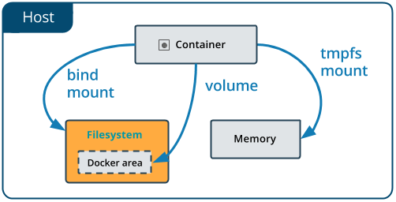

# 04. 🥙 目录挂载

### 现存问题

- 使用 Docker 运行后，我们改了项目代码不会立刻生效，需要重新`build`和`run`，很是麻烦。
- 容器里面产生的数据，例如 log 文件，数据库备份文件，容器删除后就丢失了。

> 目录挂载解决以上问题
> 

> 本文档课件配套 视频教程
> 

### 几种挂载方式

- `bind mount` 直接把宿主机目录映射到容器内，适合挂代码目录和配置文件。可挂到多个容器上
- `volume` 由容器创建和管理，创建在宿主机，所以删除容器不会丢失，官方推荐，更高效，Linux 文件系统，适合存储数据库数据。可挂到多个容器上
- `tmpfs mount` 适合存储临时文件，存宿主机内存中。不可多容器共享。

文档参考：[https://docs.docker.com/storage/](https://docs.docker.com/storage/)

### 挂载演示

`bind mount` 方式用绝对路径 `-v D:/code:/app`

`volume` 方式，只需要一个名字 `-v db-data:/app`

示例：

`docker run -p 8080:8080 --name test-hello -v D:/code:/app -d test:v1`

> 注意！
> 
> 
> 因为挂载后，容器里的代码就会替换为你本机的代码了，如果你代码目录没有`node_modules`目录，你需要在代码目录执行下`npm install --registry=https://registry.npm.taobao.org`确保依赖库都已经安装，否则可能会提示“Error: Cannot find module ‘koa’”
> 
> 如果你的电脑没有安装 [nodejs](https://nodejs.org/en/)，你需要安装一下才能执行上面的命令。
>