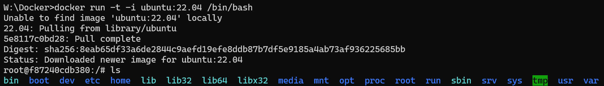

# 2023.12.12-制作定制镜像

## 1. 获取Ubuntu系统

```bash
docker run -it ubuntu:22.04 /bin/bash
```



## 2. 在容器内配置容器

```bash
apt-get update && apt-get upgrade
```

## 3. 将容器打包成镜像

```bash
docker commit -m="geant4 installed" -a="OutisPKU" f87240cdb380 outispku/geant4:v1
```

## 4. 将镜像实例化为容器并运行终端

```bash
docker run -it -v D:\BaiduSyncdisk\Postgraduate\Research\Geant4\Project:/home --name geant4_test outispku/geant4:v1 /bin/bash
```

其中`-v D:\BaiduSyncdisk\Postgraduate\Research\Geant4\Project:/home`为将主机的目录映射到容器中

# 使用Dockerfile创建镜像

## 1. 编写容器启动脚本`start.sh`

```bash
#!/bin/bash

# Source Geant4 environment scripts
source /geant4/bin/geant4.sh
source /geant4/share/Geant4/geant4make/geant4make.sh

# 获取系统的线程数
NUM_THREADS=$(expr $(nproc) - 1)

cd /program

# 构建命令
CMD_TO_ADD="/run/numberOfThreads $NUM_THREADS"

# 将命令添加到 run.mac 的第一行
sed -i "1i $CMD_TO_ADD" ./run.mac

# 定义目录路径
BUILD_DIR="/program/build"

# 检查目录是否存在
if [ -d "$BUILD_DIR" ]; then
    # 如果目录存在，删除它
    rm -rf "$BUILD_DIR"
fi

# 创建新的目录
mkdir -p "$BUILD_DIR"
cd build
cmake ..
make -j $NUM_THREADS
# PKU_Trim_Geant4 为程序名称（可执行文件），由CMakeLists.txt中的add_executable(PKU_Trim_Geant4 PKU_Trim_Geant4.cc)决定
# 使用前请修改
./PKU_Trim_Geant4 run.mac > /dev/null 2>>error.txt
```

## 2. 编写`Dockerfile`

```docker
# 原单Geant4镜像
FROM outispku/geant4:v1

# 指定启动脚本
COPY start.sh /
RUN chmod +x /start.sh
RUN mkdir program
ENTRYPOINT ["/start.sh"]
```

## 3. 构建镜像

```bash
docker build -t outispku/geant4:v2 .
```

## 4. 运行容器

```bash
docker run -v D:\FinFET:/program --name geant4_program outispku/geant4:v2
```